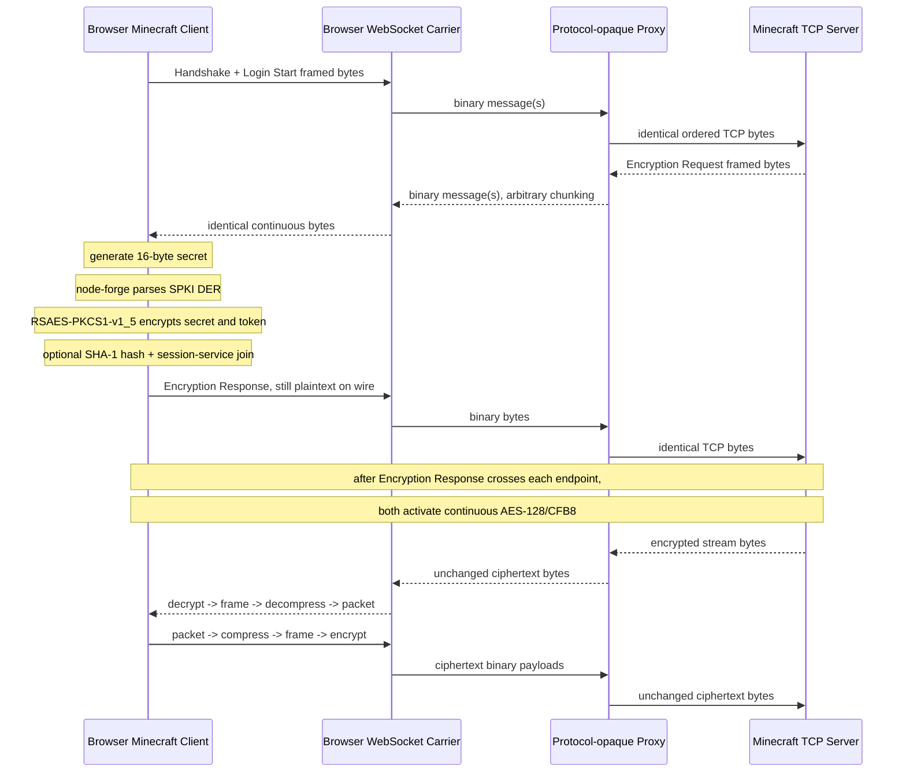

# 浏览器 WebSocket Minecraft Transport 初步计划

- 状态：探索性计划，尚未形成最终 API 或模块设计
- 记录日期：2026-08-10
- 适用版本：仓库所选择的 Minecraft 官方版本；本计划不改变版本选择
- 当前范围：核心可行性、密码算法、传输边界、代理职责、字节流流程和后续验证路径

## 已实测可用的两个浏览器密码库

以下两个库不是仅根据 README 推测可用，而是已经安装锁定版本、编写临时代码并在实际 Chrome 中执行过：

| 用途                 | 库与 GitHub 地址                                              | 已完成的验证                                                                                                                                                                                                       | 当前结论                         |
|----------------------|---------------------------------------------------------------|--------------------------------------------------------------------------------------------------------------------------------------------------------------------------------------------------------------------|----------------------------------|
| Minecraft Login RSA  | `node-forge@1.4.0` — <https://github.com/digitalbazaar/forge> | 在 browser-target bundle 中解析 X.509/SPKI DER RSA 公钥，并以 `RSAES-PKCS1-V1_5` 加密含 `0x00`、`0x80`、`0xff` 的任意二进制数据；Node/OpenSSL 私钥解密恢复完全相同的原始字节；实际 headless Chrome smoke test 通过 | **已实测算法正确且浏览器可运行** |
| Minecraft stream AES | `aes-js@3.1.2` — <https://github.com/ricmoo/aes-js>           | 使用 `new aesjs.ModeOfOperation.cfb(secret, secret, 1)` 实现 AES-128/CFB8；输出与 Node/OpenSSL `aes-128-cfb8` 完全一致；不同加密/解密分块边界、双向独立状态和实际 headless Chrome smoke test 均通过                | **已实测算法正确且浏览器可运行** |

两个库还完成了组合测试：node-forge 加密的 16 字节 shared secret 经 RSA 私钥正确解出后，直接作为 aes-js 的 AES-128 key 与
IV；8,193 字节连续数据在收发两侧采用不同 chunk 边界时仍与 OpenSSL 完全一致。

这里的“已实测可用”特指浏览器密码算法、二进制转换、连续 cipher state 和两库组合成立；尚不等同于本项目已经 通过 WebSocket
代理完成官方 Minecraft 服务器的完整 Login/Configuration/Play 端到端互操作，后者仍属于本计划 后续阶段。

## 1. 目的与当前结论

目标是在浏览器中运行本项目的 Minecraft Java Edition client。浏览器不能直接建立任意 TCP 连接，因此由 浏览器建立 WebSocket
连接，再由外部代理将 WebSocket 二进制数据与 Minecraft 服务器 TCP 字节流双向转换。

当前结论是：这个方向在协议和密码算法层面可行，但 transport API、Kotlin Multiplatform source set、 WebSocket
背压、浏览器客户端装配方式和端到端测试架构仍需进一步设计。

核心设计原则暂定如下：

1. Minecraft 协议、压缩、认证和加密全部留在浏览器客户端。
2. 转换代理是 Minecraft 协议不透明的 WebSocket/TCP 字节中继，不解析包、VarInt、压缩或加密。
3. WebSocket message 边界和 TCP read/write 边界均没有 Minecraft 语义，只代表连续字节流的任意分段。
4. 一个 WebSocket 连接初步对应一个 TCP 连接，不设计多路复用。
5. TCP 和 WebSocket carrier 应共享现有 framing、compression、encryption 和 session 逻辑。
6. 新能力不得使只使用 TCP transport 的消费者被迫引入 WebSocket client 依赖。

安全策略、浏览器跨域、证书、鉴权、限流和代理滥用防护按当前讨论要求暂不设计，但它们并未被认定为不需要， 只是有意留到核心数据路径明确之后。

## 2. 已核对的仓库现状

### 2.1 现有职责边界

- `protocol-transport` 拥有 Minecraft VarInt framing、zlib envelope、连续 AES-128/CFB8 加解密和 Ktor byte channel I/O。
- `protocol-session` 拥有 packet direction、connection state、packet ID、compression 激活时机和加密激活调用。
- `protocol-auth` 拥有 Login key exchange、shared secret、verify token、SHA-1 server hash 和 Session Server API。
- `protocol-client` 拥有从 Status、Login、Configuration 到 Play 的客户端编排。
- 外部转换代理不应依赖上述任何业务模块。

现有 `MinecraftFrameStream` 已经以 `ByteReadChannel` 和 `ByteWriteChannel` 为构造边界，不要求其内部直接持有 TCP `Socket`
。这是 WebSocket carrier 可以复用现有 framing/compression/encryption 的关键基础。

现有 `MinecraftTransport` 则是 TCP-specific convenience wrapper，直接持有 Ktor `Socket`。现有
`MinecraftClientConnection.connect` 也直接创建 TCP socket，因此浏览器支持不只是新增一个 socket 实现，还需要将浏览器可复用的
client orchestration 与 TCP-specific connection factory 分开配置。

### 2.2 当前平台限制

- `protocol-transport`、`protocol-session` 和 `protocol-client` 当前只发布 JS Node 和 WasmJS Node 变体，没有 browser 变体。
- `protocol-transport` 的 `webMain` AES 实现实际调用 Node `crypto.createCipheriv("aes-128-cfb8")`，不能直接用于 浏览器。
- `protocol-transport` 的 Web zlib 由 Kompress 提供，理论上可复用到浏览器，但尚未经过本方案的浏览器目标验证。
- `protocol-auth` 已配置 JS/WasmJS browser target，并通过 internal node-forge backend 实现浏览器 Login RSA；这不提供
  browser socket carrier 或 AES-CFB8。
- `protocol-session` 的核心公共 API 实际依赖 `MinecraftFrameStream`，但其当前构建和文档仍将它视为 TCP-only。

### 2.3 正确的 wire transform 顺序

发送方向保持现有顺序：

```text
typed packet
  -> packet ID + payload serialization
  -> compression envelope（启用后）
  -> VarInt frame
  -> 连续 AES-128/CFB8（启用后）
  -> carrier bytes
```

接收方向保持逆序：

```text
carrier bytes
  -> 连续 AES-128/CFB8 decrypt（启用后）
  -> VarInt frame split
  -> compression envelope decode（启用后）
  -> packet ID + payload decode
  -> typed packet
```

WebSocket 只替代最末端的 carrier，不改变上述任何 Minecraft transform。

## 3. 已验证的浏览器密码学结论

### 3.1 Minecraft 客户端需要的能力

Online Login 的关键能力为：

1. 生成 16 字节随机 shared secret。
2. 解析服务器发送的 X.509 SubjectPublicKeyInfo DER RSA 公钥。
3. 使用 RSAES-PKCS1-v1_5 加密 shared secret 和 verify token。
4. 使用 shared secret 同时作为 AES-128 key 和 IV。
5. 在连接的两个方向分别维持一个连续 AES-CFB8 状态。
6. 计算 Minecraft 使用的有符号 SHA-1 server hash。

浏览器 Web Crypto 可以提供随机字节和 SHA-1 digest，但没有 Minecraft 要求的 AES-CFB8，也没有用于加密的 RSAES-PKCS1-v1_5。因此
AES 和登录 RSA 需要额外实现。

### 3.2 当前经过验证的 npm 组合

#### RSA：`node-forge@1.4.0`

仓库：<https://github.com/digitalbazaar/forge>

使用范围仅限 `protocol-auth` 的浏览器密码学实现：

- `forge.asn1.fromDer` 读取 DER；
- `forge.pki.publicKeyFromAsn1` 读取服务器 SPKI RSA 公钥；
- `publicKey.encrypt(binary, "RSAES-PKCS1-V1_5")` 执行登录加密；
- 用 `forge.util.binary.raw.encode/decode` 在 `Uint8Array` 与 forge binary string 之间无损转换。

已验证任意二进制输入，包括 `0x00`、`0x80` 和 `0xff`；由 node-forge 加密后，Node/OpenSSL 使用 RSA PKCS#1 v1.5
私钥解密能够恢复完全相同的字节。

该包在记录日约有 5.3k GitHub stars 和 3,691 万 npm 周下载，且 2026 年有正式版本发布。它满足当前对 使用规模和近期维护的筛选要求。

#### AES-CFB8：`aes-js@3.1.2`

仓库：<https://github.com/ricmoo/aes-js>

正确构造方式为：

```javascript
const encryptor = new aesjs.ModeOfOperation.cfb(secret, secret, 1)
const decryptor = new aesjs.ModeOfOperation.cfb(secret, secret, 1)
```

约束如下：

- 第三个参数单位是字节；`1` byte 等于 CFB8。
- 即使该参数默认值为 `1`，实现中也应显式传入，避免被 README 中使用 `8` 的示例误导。
- encryptor 和 decryptor 必须是两个独立实例。
- 每个实例必须跨 Minecraft packet、WebSocket message 和底层 read/write chunk 持续存在。
- 不能在 packet 边界调用 final 或重建实例。

已验证结果：

- `aes-js` 的输出与 Node/OpenSSL `aes-128-cfb8` 完全一致；
- 4,097 字节输入跨 12 个不同大小的 chunk 后仍然一致；
- 组合测试使用 8,193 字节，并让加密和解密侧采用不同的分块边界，双向结果均一致；
- 使用 RSA 解出的同一个 16 字节 secret 立即建立 AES key/IV，组合流程通过；
- browser-target bundle 不需要 Node `Buffer`、`stream` 或 `events` polyfill；
- 实际 headless Chrome 已成功加载 bundle，并通过 SPKI/RSA 与连续 AES-CFB8 smoke test。

维护风险：稳定版较旧，GitHub 约有 1.5k stars，记录日约有 397 万 npm 周下载。它不是无人使用的包，且其 CFB8 行为已经验证，但近期维护弱于
`node-forge`。若采用，应把它限制在一个很薄的内部 browser adapter 后， 保留未来替换能力。

### 3.3 已排除或暂不选择的候选

- `JSEncrypt`：项目活跃且 stars 更多，但高层接口对输入执行文本/UTF-8 处理，不能无损处理 Minecraft 的任意 二进制 shared
  secret 和 verify token；实测失败。
- `@noble/ciphers`：活跃、使用量大，但内置 `cfb()` 是 CFB128，不是 CFB8。可以在低层 AES block API 上写 很小的 CFB8 feedback
  adapter，但该 API 标记为 `unsafe`，当前不优先采用。
- `browserify-aes`：原生支持 `aes-128-cfb8`，但包版本和直接维护较旧，而且 browser bundle 需要 Node
  `Buffer`、`stream` 和 `events` 等兼容层。
- 浏览器原生 Web Crypto：不能直接提供 AES-CFB8 或 RSAES-PKCS1-v1_5 encryption，不能单独完成登录。

### 3.4 临时验证证据

这些文件位于 `temp/`，只作为 agent 调查证据，不是 Gradle 输入或生产实现：

- `temp/npm-crypto-browser-eval/verify.mjs`
- `temp/npm-crypto-browser-eval/verify-node-forge-aes-js.mjs`
- `temp/npm-crypto-browser-eval/browser-smoke.mjs`
- `temp/npm-crypto-browser-eval/browser-smoke.html`
- `temp/npm-crypto-browser-eval/package-lock.json`

粗略 Node V8 benchmark 中，`aes-js` 连续 CFB8 约为 1.4 MiB/s。该结果不是浏览器性能结论，但提示在正式采用 前必须测量实际
Chrome/Firefox 中的 chunk loading 吞吐、CPU 和内存。

## 4. 初步总体架构

```mermaid
flowchart LR
    subgraph Browser[浏览器进程]
        Client[protocol-client orchestration]
        Session[protocol-session]
        Frames[framing + compression]
        Crypto[AES-CFB8 stream]
        WsCarrier[WebSocket byte carrier]
        Client --> Session --> Frames --> Crypto --> WsCarrier
        WsCarrier --> Crypto --> Frames --> Session --> Client
    end

    subgraph Relay[外部 WebSocket/TCP 转换代理]
        WsEndpoint[WebSocket endpoint]
        Pumps[两个有界 byte pumps]
        TcpSocket[TCP socket]
        WsEndpoint <--> Pumps <--> TcpSocket
    end

    Server[Minecraft Java Server]
    WsCarrier <-->|ordered binary messages| WsEndpoint
    TcpSocket <-->|ordered TCP bytes| Server
```



这个代理是“Minecraft 业务无关”而不是“完全无状态”：它仍然必须维护 WebSocket/TCP 连接配对、目标地址、 有界缓冲、背压、关闭和错误传播，但不理解
payload 的业务含义。

## 5. WebSocket carrier 的初步语义

### 5.1 字节透明性

WebSocket carrier 必须满足：

- 只发送 binary message，不使用文本或 Base64。
- 一个 binary message 的 payload 是 TCP 字节流中的任意连续片段。
- 一个 Minecraft frame 可以跨多个 WebSocket message。
- 一个 WebSocket message 可以包含多个 Minecraft frame。
- Encryption Response 的明文字节和随后启用 AES 后的密文字节，理论上也可以处于同一个 WebSocket message； 唯一重要的是字节顺序和加密切换的精确
  byte offset。
- 收到的 WebSocket binary payload 按到达顺序写入浏览器侧连续输入 channel。
- 从浏览器侧连续输出 channel 读取任意有界 chunk，并发送为 WebSocket binary message。

因此不能把 WebSocket message 当成 Minecraft packet，也不需要在 WebSocket payload 内额外添加 Minecraft packet length 之外的
framing。

### 5.2 初步 channel bridge

优先验证现有 `MinecraftFrameStream(ByteReadChannel, ByteWriteChannel)` 是否可以直接复用：

1. incoming pump 将每个 WebSocket binary payload 顺序写入一个 `ByteChannel`；
2. `MinecraftFrameStream.input` 从该 channel 读取连续字节；
3. `MinecraftFrameStream.output` 写入另一个 channel；
4. outgoing pump 从该 channel 读取有界 chunk，并调用 WebSocket binary send；
5. 任意一侧结束或失败时，以 structured cancellation 结束两个 pump 并关闭连接。

如果 Ktor/browser channel 的 flush、关闭或背压语义无法表达所需行为，再考虑引入最小的 transport-neutral async byte
source/sink 抽象。当前不应提前新建自定义 I/O 层。

### 5.3 背压和缓冲

尚未确定具体阈值，但正式设计必须保证：

- incoming 和 outgoing queue 均有上限；
- WebSocket 发送慢时暂停从 MinecraftFrameStream 输出侧继续读取；
- TCP/代理上游发送慢时暂停读取 WebSocket message；
- 浏览器原生 WebSocket 若只能通过 `bufferedAmount` 观察发送积压，必须定义可取消的等待策略；
- 不因单个大型 Configuration/Play packet 创建无界复制链；
- 保留现有 maximum frame 和 maximum uncompressed packet 限制。

## 6. 转换代理的初步契约

### 6.1 代理必须做的事情

每个 WebSocket 连接：

1. 决定或读取一个 TCP upstream 地址；
2. 建立一个 TCP 连接；
3. 启动 `WebSocket binary payload -> TCP writeFully` pump；
4. 启动 `TCP read -> WebSocket binary send` pump；
5. 保持每个方向的字节顺序；
6. 任一方向 EOF、close 或失败时，确定性地停止另一方向并释放两端资源。

### 6.2 代理明确不做的事情

- 不读取或生成 Minecraft packet ID。
- 不解析 VarInt frame length。
- 不压缩或解压 zlib envelope。
- 不生成、保存或使用 Minecraft shared secret。
- 不执行 RSA、AES、server hash 或 session-service 调用。
- 不判断连接是否已经启用加密。
- 不理解 Handshake、Login、Configuration 或 Play state。
- 不按 Minecraft packet 边界拆分或合并 WebSocket message。

同一个代理实现在离线明文连接和在线加密连接之间不应有任何行为差异。

### 6.3 upstream 选择

为了先证明核心字节路径，第一版代理优先固定 upstream host/port。这样 WebSocket 建立后立即进入纯二进制转发， 不需要自定义控制协议。

浏览器连接配置必须把两个地址明确分开：

- `proxyWebSocketUrl` 只用于建立 WebSocket carrier；
- `minecraftServerAddress` 和 `minecraftServerPort` 表示真正的 upstream，并继续写入 Minecraft
  `HandshakePacket`。

不能把代理 URL 的 host/port 自动当成 Minecraft Handshake 地址，否则虚拟主机、服务端路由和状态查询的语义 会被意外改变。固定
upstream 代理也应保证其配置目标与客户端声明的 Minecraft 目标一致；是否由代理验证这种 一致性属于以后 control-plane
设计，不需要解析 Minecraft payload。

未来若需要动态选择 upstream，可以选择以下之一：

- WebSocket URL path/query 中携带目标；
- upgrade 前由普通 HTTP API 创建 tunnel；
- WebSocket 建立后的第一个明确 control message，成功后不可逆地切换为 binary tunnel mode。

目标选择属于通用 tunnel control plane，不等于感知 Minecraft 业务。但 control bytes 绝不能与透明 TCP payload 混用或依靠猜测区分。

### 6.4 关闭模型

浏览器 WebSocket 没有与 TCP 完全等价的 half-close。第一版可采用简单且确定的策略：任一端正常关闭、EOF 或
失败，都关闭整个连接对。是否需要更精确的半关闭传播留待真实需求证明后再设计。

## 7. Online Login 的端到端流量流程



现有客户端顺序是先 `session.send(EncryptionResponse)`，成功后再 `session.enableEncryption(sharedSecret)`；该
顺序应保留。WebSocket pump 可以改变物理 chunk 边界，但不能改变 channel 内的字节顺序。

Set Compression 仍由 `protocol-session` 在收到对应 packet 后激活；代理不参与压缩切换。

## 8. 初步模块方案

### 8.1 推荐方向：carrier-specific 可选模块

初步倾向新增独立的 `protocol-websocket-transport` published module，而不是让所有
`protocol-transport` 消费者自动引入 WebSocket client stack。

依赖方向建议为：

```text
protocol-websocket-transport
    -> protocol-transport 的 browser-capable frame/cipher API
    -> Ktor WebSockets 或最窄浏览器 WebSocket binding

protocol-session
    -> protocol-transport

protocol-client
    -> protocol-session + protocol-auth
```

代理是外部独立服务，不依赖任何上述模块。

### 8.2 `protocol-transport` 可能需要的整理

要让 browser variant 存在，可能需要：

- 保留 `MinecraftFrameCodec`、`MinecraftFrameStream`、zlib 和 cipher API 为 browser-capable 部分；
- 将 Ktor `Socket` 和 `MinecraftTransport` 放入 TCP-capable source set；
- 将 `ktor-network` 依赖从所有 target 的公共依赖中缩窄到 TCP-capable source set；
- 为 JS/Wasm browser source set 提供基于 `aes-js` 的 AES-CFB8 actual；
- 保留 Node source set 对 Node `crypto` 的调用，不因为 browser 支持而降低 Node 实现；
- browser AES npm 包保持 `implementation`，不泄漏到公共 ABI。

是否需要新建 `protocol-transport-core` 尚未决定。优先评估在现有模块内通过 source-set capability 分层完成，
避免无必要的模块迁移和发布兼容破坏。

### 8.3 `protocol-session` 和 `protocol-client`

- `protocol-session` 的核心依赖是 `MinecraftFrameStream`，理论上可增加 browser target；需要同步修改其当前 “public contract
  requires TCP” 的文档和验证假设。
- `MinecraftClientProtocol` 已经只依赖 `MinecraftSession`，适合作为 transport-neutral orchestration 保留。
- `MinecraftClientConnection` 和其公开 `Socket` 属性是 TCP-specific，应放入 TCP capability source set，或由
  transport-neutral connection facade 替代。
- 第一阶段不必立即提供浏览器 convenience connection class；浏览器代码可以先显式装配 WebSocket frames、
  `MinecraftSession` 和 `MinecraftClientProtocol`，待接口稳定后再增加便利 API。

### 8.4 `protocol-auth`

- 浏览器 RSA 实现属于 `protocol-auth`，不属于 WebSocket transport 或代理。
- 优先使用浏览器原生 `crypto.getRandomValues` 生成 secret；RSA primitive 交给 node-forge。
- 当前公共 API 已拆成 `MinecraftClientKeyExchange`、`MinecraftServerKeyPair` 和 opaque challenge；平台 backend 保持
  internal。浏览器 carrier 工作不得重新合并或复制这些能力。
- 现有 `MinecraftServerHash.compute` 应通过 browser target 测试验证，而不是重新实现 SHA-1 或 signed bigint。

## 9. 分阶段实施与验证计划

### 阶段 0：确定 carrier 和 source-set 设计

- 核对当前版本 Ktor WebSockets 在 Kotlin/JS browser 与 Kotlin/WasmJS browser 的支持和二进制 API。
- 比较 Ktor `HttpClient` WebSocket 与浏览器原生 WebSocket binding 的依赖、背压和取消语义。
- 验证 `ByteChannel` bridge 的 flush、close、failure 和 bounded buffering 行为。
- 确定 `protocol-transport` 内 capability source set 与独立 `protocol-websocket-transport` 的最终边界。
- 检查所有新增公开类型的 published dependency scope。

完成门槛：形成一份明确 API 草案和 source-set 图，且 TCP 消费者不会被迫引入 WebSocket 依赖。

### 阶段 1：纯字节 tunnel proof

- 实现独立、固定 upstream 的最小转换代理。
- 实现浏览器 WebSocket binary carrier，不接 Minecraft packet 逻辑。
- 用包含零字节和高位字节的随机数据验证双向 byte-for-byte 一致。
- 覆盖任意 WebSocket message 拆分、合并、close、EOF 和异常传播。

完成门槛：代理两端计算的字节数量和 digest 一致，代理不引用 Minecraft 模块。

### 阶段 2：未加密 Minecraft Status

- 让浏览器通过代理完成 Handshake -> Status -> Ping/Pong。
- 验证一个 Minecraft frame 跨多个 WebSocket message，以及多个 frame 合并在一个 message。
- 保持现有 frame size、VarInt 和 malformed-input 行为。

完成门槛：仓库所选官方服务器返回的 Status 与 pong 可由生产 packet codec 正确解码。

### 阶段 3：compression 与离线 Login

- 验证 Set Compression 激活时机。
- 通过代理进入 Configuration，并最终进入 Play。
- 验证大型 registry/chunk 相关 packet 在有界缓冲下运行。
- 验证 Kompress browser 路径与官方服务器 zlib envelope 互操作。

完成门槛：浏览器 client 通过固定 upstream 代理，以离线身份到达 Play。

### 阶段 4：浏览器 online-mode 密码学

- 复用并验证 `protocol-auth` 已有的 node-forge browser backend。
- 在 `protocol-transport` 增加 aes-js browser AES-CFB8 adapter。
- 把当前 temp 互操作场景转化为 owning module 的确定性测试。
- 覆盖任意二进制 RSA 输入、独立收发 cipher state、不同 carrier chunk 边界和 encryption transition。
- 验证 Kotlin/JS browser 与 Kotlin/WasmJS browser 的 npm/JS interop；两者不能相互推断为已支持。

完成门槛：浏览器 client 通过代理完成官方 online-mode Login 的 Encryption Request/Response，并进入后续状态。

### 阶段 5：完整客户端与运行特性

- 通过代理完成 Login、Configuration 和 Play entry。
- 在真实浏览器测量 AES-CFB8、zlib、WebSocket buffered amount、内存峰值和 chunk loading 吞吐。
- 根据测量结果决定是否继续采用 aes-js、推动上游 CFB8，或切换到维护更积极的实现。
- 明确 reconnect、timeout、close reason 和错误归一化。
- 设计符合仓库 Fixture Host 与标准 KMP task 规则的可重复互操作验证；不添加临时 launcher 或旁路 task。

完成门槛：生产 browser client 通过协议不透明代理到达 Play，且无无界队列、状态重置或 target 依赖泄漏。

## 10. 必须保留的测试不变量

1. TCP 和 WebSocket carrier 使用相同的 `MinecraftFrameCodec` 行为。
2. WebSocket message 边界变化不能改变解码结果。
3. AES encryptor/decryptor 跨所有 packet 和 carrier chunk 保持状态。
4. 收发方向 cipher state 相互独立。
5. Encryption Response 本身不加密，紧随其后的第一个字节开始使用协商后的 AES 状态。
6. compression 和 encryption 的激活时机仍由 session/client orchestration 决定。
7. proxy 转发明文、密文或随机字节时执行完全相同的代码路径。
8. proxy 不因 payload 看似 VarInt、zlib header 或 Minecraft packet 而改变行为。
9. 任意一端终止后，所有 pump、channel、WebSocket 和 TCP socket 都确定性清理。
10. published browser variant 不依赖 Node built-in modules；published TCP consumers 不获得不必要的 WebSocket runtime
    dependency。

## 11. 尚未解决的关键问题

- Ktor WebSockets 还是浏览器原生 WebSocket 更适合作为最窄、可维护的 carrier API。
- Kotlin/WasmJS 对 node-forge 和 aes-js 的绑定、bundle 和异常语义是否与 Kotlin/JS 等价。
- browser WebSocket 的实际背压策略与合理的 queue/chunk 大小。
- aes-js 在真实浏览器和大量 chunk/registry 流量下的吞吐是否足够。
- Kompress 的 browser compression/decompression 性能和边界行为。
- `protocol-auth` 的现有 client/server key-exchange API 在 Kotlin/WasmJS browser bundle 中是否保持与 Kotlin/JS 等价。
- TCP-only convenience API 如何移动 source set 而不造成不必要的发布兼容破坏。
- dynamic upstream control plane 的具体协议。
- WebSocket proxy URL、TCP upstream 地址与 Minecraft Handshake 地址之间的配置和一致性规则。
- 浏览器专用端到端验证如何接入现有 Fixture Host，而不违反标准 task 和资源所有权规则。
- 安全、跨域、WSS、认证、目标白名单和部署策略；这些按当前范围有意延期。

## 12. 当前推荐基线

在进入精细 API 设计前，当前最合理的基线是：

- 保持代理为协议不透明的一对一 WebSocket/TCP tunnel；
- 第一版代理固定 upstream；
- 优先新增独立 `protocol-websocket-transport`，不把 WebSocket 依赖强加给 TCP 用户；
- 复用 `MinecraftFrameStream` 的 framing/compression/encryption，不复制协议逻辑；
- 浏览器 RSA 暂定 [`node-forge@1.4.0`](https://github.com/digitalbazaar/forge)，其浏览器执行和二进制 RSAES-PKCS1-v1_5
  互操作已经实测通过；
- 浏览器 AES-CFB8 暂定 [`aes-js@3.1.2`](https://github.com/ricmoo/aes-js)，显式 `segmentSize = 1`，其 浏览器执行、OpenSSL
  互操作和跨 chunk 连续状态已经实测通过，并通过内部 adapter 隔离；
- 先完成随机字节 tunnel 和 Status，再依次验证 compression、offline Play、online encryption 和完整 Play；
- 在真实浏览器性能数据产生前，不把 aes-js 视为不可替换的长期依赖。

这份计划记录的是已验证基础和下一步设计空间，不构成对最终模块名、公开 API、代理部署协议或 npm 依赖的永久承诺。
