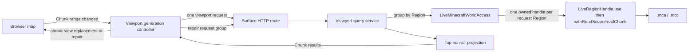

# Minecraft 网页地图 Demo 实施计划

- 状态：待实施，核心交互、失败语义与 live Region 生命周期已经确定
- 记录日期：2026-08-27
- 适用版本：仓库所选择的 Minecraft 官方版本；本计划不改变版本选择
- 计划模块：`:demo:web-map`
- 当前范围：独立网页地图进程、视口批量查询、Chunk 表面投影、live world 读取和错误 Chunk 轮询
- 后端目标：`jvm`、`linuxX64`、`linuxArm64`、`mingwX64`、`macosArm64`
- 浏览器产物：Kotlin/JS browser bundle；它是由后端提供的网页资源，不是额外的后端运行平台

## 1. 目标与结论

新增一个独立于现有 Minecraft 客户端和服务端的 Demo。用户启动该程序并提供一个正在被 Minecraft
服务端使用的世界目录，随后通过浏览器访问网页地图。程序只观察磁盘上已经保存的世界数据，不接入服务端进程，
也不尝试读取仍只存在于服务端内存中的变化。

已经确定的总体设计如下：

1. 浏览器根据当前视窗计算一个包含两端的 Chunk 矩形范围，并用一个 HTTP 请求查询整个范围。
2. 浏览器拖动或缩放时不连续请求；交互停止后经过约 200 ms 防抖再查询当前视窗。
3. 后端按请求范围枚举 Chunk 并按 Region 分组；每个请求内为每个 Region 创建一个 `LiveRegionHandle`，使用
   `openRegion(...).use { withReadScope { readChunk(...) } }` 连续解码该组 Chunk。
4. 后端只提取每个 X/Z 列中最高的非空气方块，返回 16 × 16 的二维表面数据，不渲染图片。
5. Region 文件不存在或 header 中没有目标 Chunk 时，响应省略该 Chunk；Chunk payload 读取、解压或解码失败时返回错误标识。
6. 每个 HTTP 请求独立打开和关闭自己的 Region handles。后端不缓存结果，也不合并、共享或协调同时到达的请求。
7. 视窗请求期间继续显示旧内容；新响应到达后再整体替换当前视窗状态。错误 Chunk 使用单-Chunk请求延迟轮询，直到成功或省略。
8. 一致性单位是一个成功解码的 Chunk。每个 Region 组通过 `withReadScope` 只读取一次 header，但该 header、后续 `.mca`
   payload 或 `.mcc` sidecar 仍可能来自不同保存时刻；不同 Chunk 来自不同保存时刻是可接受的。

本设计在当前仓库能力上可行。`world-format` 已提供 Chunk/Region 坐标、Anvil 压缩与语义 Chunk；`world-io` 已提供 不会取得
`session.lock` 的 live read-only 入口。外部依赖主要是 Ktor 的 HTTP 能力和浏览器地图组件。

## 2. 明确不做的事情

第一版明确不处理以下内容：

- 不在 `LiveMinecraftWorldAccess` 或 Demo 中增加共享 Region registry、引用计数、锁或写入协调。
- 不跨请求复用 `LiveRegionHandle`/`FileHandle`；每个请求的每个 Region 组独立持有一个 handle，并在组处理完成后关闭。
- 不让 `RegionReadScope`、其 sequence 或借用的 Chunk stream 逃逸出回调。
- 不构造 Region 级稳定快照、revision、ETag 或跨 Chunk 事务。
- 不观察 Region 文件变化，不实现 SSE、服务端推送或成功 Chunk 的后台刷新。
- 不在后端生成地图图片、地图瓦片或纹理图集。
- 不从官方资源、资源包或模组资源加载方块贴图；第一版只使用方块标识的确定性颜色。
- 不实现 DataFixer，也不兼容与仓库所选择版本不匹配的旧 Chunk 数据。
- 不观察服务端尚未保存到磁盘的内存状态。
- 不实现用户、权限、多世界管理、远程世界目录或面向公网的部署安全策略。

本计划使用现有 caller-owned live Region 生命周期：一个 `LiveRegionHandle` 在本请求的一个 Region 组内复用其 `.mca` 句柄，
一次 `withReadScope` 再让该组所有 Chunk 共用一遍 header 读取。后续请求重新打开 handle 和 scope，外部 `.mcc` sidecar 仍由
需要它的单个 Chunk 操作独立打开和关闭。

## 3. 已核对的仓库基础

### 3.1 `world-format`

- `RegionPosition` 覆盖 32 × 32 个 Chunk，`ChunkPosition` 和 `MinecraftCoordinates` 提供负坐标下的 floor 语义。
- `ChunkNbtCodec<BlockStateDescriptor, String>` 可以把持久化 Chunk 解码为语义 `Chunk`。
- `DescriptorBlockStateRegistry` 保留方块名称和 properties，避免在地图协议中丢失方块状态。
- `ChunkLayout` 明确要求调用方提供维度的最低 Y 与高度；地图投影不能写死全局高度。
- `Chunk.metadata.isFullyGenerated` 和原始 heightmaps 可用，但第一版表面算法不依赖高度图正确性。

### 3.2 `world-io`

- `LiveMinecraftWorldAccess` 不获取 `session.lock`、不修复或修改世界，也没有 close 生命周期。
- `openRegion` 会返回 caller-owned `LiveRegionHandle` 资源；handle 独立打开并保留创建时找到的 `.mca`，必须通过其成员
  `use` 或同步 `close()` 释放。不同 handle 不共享文件对象、registry、引用计数或生命周期。
- 普通 handle 操作会重读 Region header；Demo 为每个 Region 组使用一次 `withReadScope`，避免组内逐 Chunk 重读 header。
  cached header 仍不承诺 freshness、atomicity 或 header/payload 一致性，外部 `.mcc` sidecar 按 Chunk 操作打开和关闭。
- 如果创建 handle 时 Region 不存在，该 handle 不持有 `.mca` 并持续返回缺失结果；后续视窗请求或错误 Chunk 轮询会创建新
  handle，从而重新观察路径。
- live read 允许另一个进程同时写入，因此 I/O、Anvil framing、压缩、NBT 或 Chunk 解码失败都是预期可观察结果。

### 3.3 第三方能力

- Ktor Server 提供普通 HTTP、静态内容和 JSON content negotiation。
- 浏览器地图交互优先使用 [Leaflet](https://leafletjs.com/reference.html) 的简单平面坐标系和自定义 Canvas layer；
  Kotlin/JS 只声明实际使用的最小外部 API。

第一版不引入文件观察依赖。页面只在首次打开、视窗范围改变或错误 Chunk 到达轮询时间时读取 live world。

## 4. 模块和目标布局

使用一个新的 `:demo:web-map` Kotlin Multiplatform 子项目，保持 Demo 内部共享 DTO，同时隔离浏览器与主机文件系统能力：

```text
demo/web-map/
├── AGENTS.md
├── README.md
├── build.gradle.kts
└── src/
    ├── commonMain/       # 可序列化 API DTO、包含边界的 Chunk 范围和纯逻辑
    ├── commonTest/       # 坐标、范围、响应语义和表面投影测试
    ├── serverMain/       # JVM/desktop Native 共用的 Ktor 和 live world 代码
    ├── jvmMain/          # JVM executable 装配
    ├── nativeMain/       # desktop Native executable 装配
    ├── jsMain/           # 浏览器入口、Leaflet/Canvas、fetch 和请求代次控制
    └── jsTest/           # 不依赖真实浏览器 DOM、由 Gradle-provisioned Node 执行的前端状态测试
```

后端 target 集合固定为 JVM、Windows x64 (`mingwX64`)、Linux x64/ARM64 (`linuxX64`/`linuxArm64`) 和 macOS ARM64
(`macosArm64`)。不增加 `macosX64`。浏览器前端使用 Kotlin/JS browser target，但该 target 只生成由上述后端提供的 静态网页
bundle。Node 只可作为 Gradle 提供的 JS 测试运行器，不产生 Node executable 或 Node/JS server。不要增加 Android、
iOS、watchOS、tvOS、Wasm 或其他后端目标。

`serverMain` 是一个真实的 JVM + desktop Native 共享能力，因此允许创建一个自定义 source set；浏览器代码不得依赖
`world-io` 或 Ktor Server。`commonMain` 只放双方真正共享的序列化模型和纯逻辑。

Gradle 接入包括：

1. 在 `settings.gradle.kts` 注册 `:demo:web-map`。
2. 在 version catalog 增加 Ktor Server content negotiation 等缺失 alias。
3. 使用仓库根部已经声明的 Kotlin Multiplatform 和 Serialization 插件，不选择独立插件版本。
4. 配置 Kotlin/JS browser executable 和 Node test environment，并把 browser distribution、`index.html` 和 CSS 复制到每个
   server install 目录；不要发布 Node executable。
5. server 从明确的静态资源目录提供网页；开发运行可由参数传入 JS distribution 路径，安装产物使用相邻固定目录。
6. 按仓库规则为新子项目提供 README 和 AGENTS；README 只描述已经完成的启动方式和支持目标。

## 5. 运行时结构



每个视窗代次只拥有两组请求：一个完整视窗请求，以及该响应产生的一组错误 Chunk 补漏请求。Chunk 范围改变时先取消上一代的
视窗请求和全部补漏请求，再创建新代次。后端不知道前端代次，也不在不同请求之间共享 Region 资源或结果。

## 6. 视口查询契约

### 6.1 包含两端的坐标

请求使用两个 Chunk 端点，后端将四条边都视为包含：

```http
GET /api/map/{dimension}/surface?minChunkX=-10&minChunkZ=4&maxChunkX=6&maxChunkZ=15
```

语义为：

```kotlin
for (chunkZ in minChunkZ..maxChunkZ) {
    for (chunkX in minChunkX..maxChunkX) {
        // query one Chunk
    }
}
```

- 前端只要发现一个 Chunk 有任何像素与视窗相交，就把它放进范围。
- 精确边缘造成多包含一个 Chunk 是允许的，不为此增加开区间协议。
- 后端用 `minOf`/`maxOf` 规范化两端，调用方传递顺序不影响结果。
- 范围宽、高和总 Chunk 数使用 `Long` 计算并在读取前验证，避免 Int 溢出和无界请求。
- 补漏请求复用同一 endpoint，并令最小、最大 Chunk 坐标相同来查询一个 Chunk；不增加第二套 HTTP 协议。
- 前端连续世界坐标转 Chunk 坐标使用 `floor`；后端的 Chunk/Region 转换只使用 `MinecraftCoordinates`，不手写 对负数错误的
  `/` 或 `%`。

响应回显规范化后的包含边界，使前端可以把它作为该矩形的一次完整查询结果。

### 6.2 HTTP 结果

所有被应用正常处理的视口查询返回 HTTP 200。单个 Chunk 缺失或 live read 失败都不是整次 HTTP 请求失败。 未处理的程序、Ktor
或基础设施异常可以终止整个请求并成为 500；客户端不会应用不完整的响应。

后端必须先完成响应 DTO 的构造，再交给 Ktor 序列化，不能一边读取 Chunk 一边向 HTTP body 发布部分结果。

初步响应形状：

```json
{
  "minChunkX": -10,
  "minChunkZ": 4,
  "maxChunkX": 6,
  "maxChunkZ": 15,
  "chunks": [
    {
      "chunkX": -3,
      "chunkZ": 8,
      "status": "success",
      "surface": {}
    },
    {
      "chunkX": -2,
      "chunkZ": 8,
      "status": "read_failed"
    }
  ]
}
```

Kotlin 模型优先使用带 `status` discriminator 的 sealed variants，使 `success` 必须携带 surface、`read_failed`
不能意外携带半成品数据。不要使用一个 nullable surface 配合可构造出矛盾状态的普通 data class。

### 6.3 三态规则

一个请求范围内的 Chunk 有且只有以下三种可观察结果：

| 状态     | Wire 表示                | 后端含义                                                     | 前端行为                                       |
|----------|--------------------------|--------------------------------------------------------------|------------------------------------------------|
| 不存在   | 响应中没有该坐标         | Region 文件缺失，或本次 Region header 没有该 Chunk           | 不渲染；若来自补漏请求则停止轮询               |
| 成功     | `status = "success"`     | 完整读取、解压、NBT/Chunk 解码和表面投影成功                 | 使用新表面；若来自补漏请求则停止轮询           |
| 读取失败 | `status = "read_failed"` | 已定位 Chunk，但本次 payload 读取、解压或 Chunk 解码没有完成 | 暂时保留同坐标旧表面，并加入当前代次补漏请求组 |

对 Demo 而言，payload 读取、解压、NBT 或语义 Chunk 解码失败都统一视为一次撕裂的 live 观察并返回 `read_failed`，不再区分错误
层次。响应不包含内部异常文本，具体原因只通过服务端日志记录。

后端按 Chunk 捕获明确的 live-read/format/decoding 异常并继续构造同一次响应。`CancellationException` 必须立即重新抛出；
编程错误和启动配置错误不转换成 `read_failed`。

一个已存储但 16 × 16 列中都找不到非空气方块的 Chunk 仍然是 `success`，其 surface 表示 256 个空列。只有 Region header 中没有该
Chunk 时才完全省略坐标。

## 7. Chunk 表面模型与算法

### 7.1 解码上下文

启动时：

1. 从 live world 读取 `level.dat`，取得 DataVersion、出生点和启用的数据包引用。
2. 用仓库提供的 vanilla 默认与能够读取的世界数据包解析维度 registry；无法投影的模组 registry 保持显式不支持。
3. 为每个支持的维度建立 `DimensionDirectory`、`ChunkLayout` 和
   `ChunkNbtCodec<BlockStateDescriptor, String>`。
4. DataVersion 与仓库所选择版本不一致时启动失败并给出明确日志，不尝试 DataFixer。

第一版至少支持仓库所选择版本的内置主世界、下界和末地。自定义维度只有在目录映射与 dimension-type layout 都能无歧义解析时
才暴露给网页；不要猜测高度或路径。

### 7.2 最高非空气方块

每个成功 Chunk 生成 16 × 16、按 `z * 16 + x` 排列的列结果：

1. 对每个 local X/Z，从 `ChunkLayout.maxBlockY` 向 `minBlockY` 扫描。
2. 首个不满足 `isAir` 的 `BlockStateDescriptor` 是该列结果。
3. 第一版把 `minecraft:air`、`minecraft:cave_air` 和 `minecraft:void_air` 视为空气；模组空气需要以后由调用方数据扩展。
4. 找不到非空气方块时记录空列，而不是把整个 Chunk 判为不存在。
5. 返回方块名称和 properties；不要只返回进程内 raw ID，因为持久化 Chunk 的自然契约是 `BlockStateDescriptor`。

字面“最高非空气”会使下界顶部通常显示基岩屋顶，这是已经接受的语义结果，不在第一版引入维度特例或透明方块规则。

wire 数据可采用每 Chunk palette + 256 个 row-major palette index，避免重复发送相同 descriptor；这是响应表示，不是后端缓存。
是否额外返回 Y 高度、biome 或光照在实现前保持关闭，除非前端渲染的已确认需求要求它们。

## 8. 后端查询流程

一次视口请求按以下顺序执行：

1. 解析和规范化包含两端的 Chunk 范围。
2. 生成所有 `ChunkPosition` 并按 `regionPosition` 分组，然后按确定顺序逐个处理 Region 组；请求内部不再并发 fan-out。
3. 每个 Region 组调用一次 `openRegion(regionPosition).use { liveRegionHandle -> ... }`，并在 handle 内进入一次
   `withReadScope`；该 scope 为组内所有目标 Chunk 共用一遍 Region header 读取。
4. scope 中 header 没有某个 Chunk 时省略该坐标；创建 handle 时 Region 不存在会得到 empty scope，因此整组自然省略。
5. 对 header 中存在的 Chunk，调用 scope 的 `readChunk(chunkPosition, chunkNbtCodec)`；`world-io` 负责读取 payload、按
   Region 压缩标识解压、完整消费 NBT source，并用 `ChunkNbtCodec` 解码语义 Chunk。Demo 不复制 Anvil framing 或拼装解码链路。
6. 解码成功后执行表面投影并加入 `success`；单个 Chunk 的 payload 读取、解压或解码异常加入 `read_failed`，随后继续处理同组
   其他 Chunk。`CancellationException` 必须立即传播，不能转换成错误标识。
7. `withReadScope` 结束后其 sequence 和 stream 全部失效，`use` 随后关闭 handle；所有 Region 组完成后一次性返回响应。

这里使用的是普通 Chunk Region handle 所产生的 `RegionReadScope`；Entity Region handle 对应
`EntityRegionReadScope`，两者的 `readChunk` 只接受各自语义匹配的 codec。Demo 不需要再提供私有组合函数。

同步文件 I/O、解压和 NBT 工作不能运行在 Ktor selector loop 上。每个 HTTP 请求只把自己的完整查询流程交给后端工作上下文， 不创建
Region 并发任务、全局 semaphore、共享 handle cache 或请求合并器。多个请求即使同时查询同一 Region，也各自独立打开、 读取和关闭自己的
handle，彼此不等待或复用结果。

## 9. 前端请求控制与渲染状态

前端按 Chunk 范围维护单调递增的“视窗代次”。每一代最多只有两组受控请求：一个完整视窗请求，以及一个管理所有错误 Chunk 的
补漏请求组。页面初始化创建第一代；只有拖动或缩放使所需 Chunk 范围实际改变时才创建新代。

### 9.1 视窗改变

1. Leaflet/Canvas 只要判断一个 Chunk 有任何像素需要显示，就把它包含在当前范围中。
2. 所需 Chunk 范围一旦改变，立即取消上一代尚未完成的视窗请求及其整个补漏请求组，并增加代次、记录新范围。补漏组使用一个 父
   Job/AbortController 管理，使取消能够终止已发出的所有单-Chunk fetch 和后续轮询。
3. 每次范围变化都重置约 200 ms 防抖；防抖结束且范围未再次变化时，只发出一个覆盖完整新范围的视窗请求。旧的已渲染内容在
   取消和等待期间保持不变。
4. 只接受代次和范围仍匹配的完整响应；取消后仍迟到的旧响应直接丢弃。
5. 在内存中构造新视窗状态：`success` 使用新表面，省略坐标不渲染，`read_failed` 保留同坐标旧表面（若存在）并进入新代的
   补漏集合。构造完成后一次性替换显示状态，避免请求期间先清空画面。
6. 新视窗响应是该代补漏请求组的唯一来源；收到它之前不发补漏请求。

若视窗请求发生网络错误或返回 500，不应用部分状态，也不清除旧画面。第一版不为完整视窗请求增加自动重试；后续有效的范围改变或页面
重新加载会创建新代并重新请求。

### 9.2 视窗不变时补漏

1. 若当前代没有 `read_failed`，视窗不变期间不再向后端请求。
2. 若存在错误 Chunk，当前代只创建一个补漏请求组。该组等待固定间隔后，对补漏集合中的每个坐标使用同一 surface endpoint 发出
   单-Chunk范围请求，并按确定顺序逐个等待结果；不重新请求整个视窗，也不增加并发调度或额外协议。
3. 单-Chunk响应为 `success` 时更新该 Chunk 并移出补漏集合；省略该坐标时删除可能保留的旧表面并移出集合；仍为
   `read_failed` 时保留现状，在下一轮固定间隔后继续请求。
4. 每次应用补漏结果前再次核对视窗代次和坐标仍在当前范围内。补漏集合清空后，该请求组结束。
5. 一旦 Chunk 范围改变，9.1 的取消步骤终止整组补漏请求；新代只从自己的完整视窗响应重新建立补漏集合。

因此除页面自身的静态资源加载外，一次视窗代次没有第三类 world-data 请求：只有一个视窗请求和一组补漏请求。第一版不增加动态 贴图
route；Canvas 根据方块标识生成确定性颜色。浏览器不创建每方块 DOM 节点。测试通过可注入的请求端和重试调度器推进状态，
不依赖真实计时器等待。

## 10. 实施阶段

### 阶段 A：模块与共享契约

1. 注册 `:demo:web-map`，配置 common/server/browser source sets 和目标。
2. 新增 README、AGENTS、安装/开发运行入口和静态资源装配。
3. 实现包含两端的 `ChunkViewport`、surface DTO、sealed Chunk 结果和 JSON 配置。
4. 为坐标规范化、负坐标、交集和序列化 round trip 添加 portable tests。

### 阶段 B：live world 表面查询

1. 启动时建立 level/datapack/dimension 解码上下文。
2. 实现按 Region 分组的 caller-owned `openRegion(...).use { withReadScope { readChunk(...) } }` 读取、逐 Chunk
   三态映射和最高非空气投影。
3. 实现 Ktor metadata 与 surface routes；使用注入的 reader 测试 route，不让 HTTP 测试依赖真实 Minecraft 文件。
4. 证明一个 Chunk 失败不会阻止同响应中的其他成功 Chunk，也不会吞掉协程取消。

### 阶段 C：浏览器地图与请求控制

1. 建立 Leaflet 简单平面地图和 Canvas Chunk layer。
2. 实现视窗到包含边界 Chunk 范围的转换、200 ms 防抖和单调递增的视窗代次。
3. 实现新代次先取消上一代视窗请求与整个补漏请求组，再只发一个新视窗请求。
4. 实现响应后原子替换显示状态，以及只轮询 `read_failed` 坐标的单一补漏请求组。
5. 用方块标识的确定性颜色完成可视地图；真实贴图来源保持独立。

### 阶段 D：打包与文档

1. 将浏览器 distribution 和 server executable 组成可运行安装目录。
2. README 记录世界目录、监听地址、端口和支持维度的参数来源与运行步骤。
3. 说明 live read 只能观察已保存数据、`read_failed` 的暂时性以及没有 Region/全图一致性保证。
4. 只在相应目标实际编译和运行后，把该目标写入 README 支持矩阵。

## 11. 验证计划

最窄验证顺序：

```shell
./gradlew :demo:web-map:jvmTest
./gradlew :demo:web-map:jsNodeTest
```

随后执行适用的 host Native test/compile 和安装任务。涉及 JS distribution 到 server 安装目录的 Gradle wiring 时，还要验证
configuration-cache 首次存储与再次复用。只有实现过程确实修改了 `world-io`，才额外运行 `./gradlew :world-io:jvmTest`；本计划
预期直接使用现有公开 API。

必需测试覆盖：

- 包含两端的正坐标、负坐标、反向端点、单 Chunk 和跨 Region 范围。
- Region 文件缺失、Region 中 Chunk 缺失、全空气成功 Chunk 和正常表面 Chunk。
- 同一请求的同一 Region 只打开一个 live handle、只读取一次 scope header，并在回调结束后关闭；新请求重新打开 handle，
  不共享文件或生命周期。
- payload/sidecar 读取、解压、NBT 或 Chunk codec 失败映射为 `read_failed`。
- 单 Chunk 失败不阻止同 Region 的其他 Chunk，且 scope/stream/handle 没有资源泄漏。
- `CancellationException` 不转换为普通失败。
- 同一响应中 success、read_failed 和省略坐标共存。
- 表面扫描的 Y 边界、空气判定、row-major 顺序和 block-state properties 保留。
- 两个同时到达且查询相同 Region 的 HTTP 请求分别打开和关闭自己的 handle，不共享结果或 lifecycle。
- Chunk 范围改变时，上一代视窗请求和已发出的全部补漏请求都被取消，迟到结果不能改变新代状态。
- 每代只发一个完整视窗请求；补漏请求组只查询该代 `read_failed` 坐标，并在成功或省略后停止对应坐标的轮询。
- 视窗请求完成前旧画面保持不变；完整响应在内存中合成后一次替换，错误坐标可保留同坐标旧表面。
- 视窗不变且没有错误 Chunk 时不发 world-data 请求；重试测试使用注入调度器，不依赖真实 delay。
- surface route 在完整 DTO 构造前不发布部分 HTTP 响应。

真实世界 smoke test 使用仓库所选择版本生成的临时世界，并在官方服务端运行时以只读方式访问。测试不得取得
`session.lock`、修改世界或把 Fixture Host 路径暴露为生产 API。浏览器自动化不是仓库 gate；可用 Node 测试纯前端逻辑，再进行一次人工
浏览器渲染检查。

## 12. 完成标准

计划完成时应满足：

1. 一个独立安装产物能够用世界目录启动 Ktor 服务并提供网页。
2. 页面首次打开和视窗停止移动后只发送一个包含边界的 surface 请求。
3. 后端为范围内每个可读 Chunk 返回最高非空气表面，真实缺失 Chunk 被省略，读取失败返回 `read_failed`。
4. 单个 Chunk 失败不会破坏同一响应内其他成功 Chunk；前端只通过当前代补漏请求组轮询错误 Chunk，直到成功或省略。
5. Chunk 范围改变时先取消上一代视窗请求和全部补漏请求；新响应返回前保留旧画面，返回后一次替换。
6. 后端没有世界表面缓存、图片渲染、共享 Region coordinator 或跨请求文件生命周期；只使用请求内每 Region 一个 caller-owned
   handle 和 callback-bound read scope。
7. 现有 `world-format`/`world-io` 边界未被反转，live observer 从不获取 `session.lock` 或修改世界。
8. JVM、Kotlin/JS Node test-runner 逻辑测试和已声明的 host target 验证通过，README 与实际产物一致。
