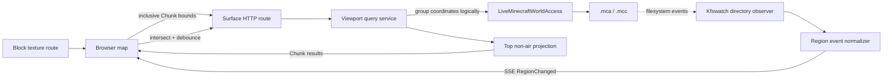

# Minecraft 网页地图 Demo 实施计划

- 状态：待实施，核心交互与失败语义已经确定
- 记录日期：2026-08-26
- 适用版本：仓库所选择的 Minecraft 官方版本；本计划不改变版本选择
- 计划模块：`:demo:web-map`
- 当前范围：独立网页地图进程、视口批量查询、Chunk 表面投影、live world 读取、Region 文件变动通知和浏览器增量刷新
- 后端目标：`jvm`、`linuxX64`、`linuxArm64`、`mingwX64`、`macosArm64`
- 浏览器产物：Kotlin/JS browser bundle；它是由后端提供的网页资源，不是额外的后端运行平台

## 1. 目标与结论

新增一个独立于现有 Minecraft 客户端和服务端的 Demo。用户启动该程序并提供一个正在被 Minecraft
服务端使用的世界目录，随后通过浏览器访问网页地图。程序只观察磁盘上已经保存的世界数据，不接入服务端进程，
也不尝试读取仍只存在于服务端内存中的变化。

已经确定的总体设计如下：

1. 浏览器根据当前视窗计算一个包含两端的 Chunk 矩形范围，并用一个 HTTP 请求查询整个范围。
2. 浏览器拖动或缩放时不连续请求；交互停止后经过约 200 ms 防抖再查询当前视窗。
3. 后端按请求范围枚举 Chunk、推导 Region，并通过 `LiveMinecraftWorldAccess` 分别读取每个 Chunk。
4. 后端只提取每个 X/Z 列中最高的非空气方块，返回 16 × 16 的二维表面数据，不渲染图片。
5. 后端不缓存 Chunk 表面数据或渲染结果。浏览器保留已成功显示的数据，以便单个 Chunk 暂时读取失败时继续显示旧结果。
6. 文件系统观察器监视各维度的 Chunk Region 目录。`.mca` 或 `.mcc` 发生创建、修改或删除后，通过 SSE 推送受影响的 Region 坐标。
7. 浏览器只在事件 Region 与当前视窗相交时重新查询，并复用同一套防抖机制合并连续事件。
8. 一致性单位是一个成功解码的 Chunk。不同 Chunk 来自不同保存时刻是可接受的，不要求 Region 或整张地图原子一致。

本设计在当前仓库能力上可行。`world-format` 已提供 Chunk/Region 坐标、Anvil 压缩与语义 Chunk；`world-io` 已提供 不会取得
`session.lock` 的 live read-only 入口。外部依赖主要是 Ktor 的 HTTP/SSE 能力和 Kfswatch 的多平台目录事件。

## 2. 明确不做的事情

第一版明确不处理以下内容：

- 不修改 `LiveRegionHandle` 的逐调用打开/关闭文件语义。
- 不合并同一 Region 的并发读取，不跨请求复用 `FileHandle`，也不增加 Region 读取缓存。
- 不构造 Region 级稳定快照、revision、ETag 或跨 Chunk 事务。
- 不在后端生成地图图片、地图瓦片或纹理图集。
- 暂不决定从官方资源、资源包或模组资源中获取方块贴图的具体实现。
- 不实现 DataFixer，也不兼容与仓库所选择版本不匹配的旧 Chunk 数据。
- 不观察服务端尚未保存到磁盘的内存状态。
- 不实现用户、权限、多世界管理、远程世界目录或面向公网的部署安全策略。

Region 文件句柄复用属于后续性能优化。只有测量证明逐 Chunk live read 的打开、header 读取或系统调用成本成为瓶颈后， 才另行设计
callback-bound 的 live batch scope；本计划不预留伪抽象或改变现有生命周期。

## 3. 已核对的仓库基础

### 3.1 `world-format`

- `RegionPosition` 覆盖 32 × 32 个 Chunk，`ChunkPosition` 和 `MinecraftCoordinates` 提供负坐标下的 floor 语义。
- `ChunkNbtCodec<BlockStateDescriptor, String>` 可以把持久化 Chunk 解码为语义 `Chunk`。
- `DescriptorBlockStateRegistry` 保留方块名称和 properties，避免在地图协议中丢失方块状态。
- `ChunkLayout` 明确要求调用方提供维度的最低 Y 与高度；地图投影不能写死全局高度。
- `Chunk.metadata.isFullyGenerated` 和原始 heightmaps 可用，但第一版表面算法不依赖高度图正确性。

### 3.2 `world-io`

- `LiveMinecraftWorldAccess` 不获取 `session.lock`、不修复或修改世界，也没有 close 生命周期。
- `openRegion` 返回轻量 `LiveRegionHandle`；每次 `readChunk` 独立打开并关闭所需的 `.mca`/`.mcc` 资源。
- live read 允许另一个进程同时写入，因此 I/O、Anvil framing、压缩、NBT 或 Chunk 解码失败都是预期可观察结果。
- `MinecraftWorldPaths.dimension` 已公开维度根路径，但 Chunk Region 目录 accessor 当前是 internal。文件观察器不应在 Demo
  中复制维度路径规则，因此实现前需要在 `world-io` 增加一个最小的公开只读路径入口，例如
  `chunkRegionDirectory(dimension)`；它只暴露规范路径，不改变 live-read 生命周期。

### 3.3 第三方能力

- [Ktor Server](https://ktor.io/docs/server-server-sent-events.html) 提供普通 HTTP、静态内容和单向 SSE。
- [Kfswatch](https://github.com/irgaly/kfswatch) 提供 Kotlin Multiplatform 文件系统事件 Flow。实现时把精确版本放在
  version catalog 中，不在文档复制版本号。
- 浏览器地图交互优先使用 [Leaflet](https://leafletjs.com/reference.html) 的简单平面坐标系和自定义 Canvas layer；
  Kotlin/JS 只声明实际使用的最小外部 API。

文件事件只作为“相关路径可能已变化”的提示，不能作为 Chunk 数据本身。读取结果始终以随后执行的 live read 为准。

## 4. 模块和目标布局

使用一个新的 `:demo:web-map` Kotlin Multiplatform 子项目，保持 Demo 内部共享 DTO，同时隔离浏览器与主机文件系统能力：

```text
demo/web-map/
├── AGENTS.md
├── README.md
├── build.gradle.kts
└── src/
    ├── commonMain/       # 可序列化 API DTO、包含边界的 Chunk 范围和纯逻辑
    ├── commonTest/       # 坐标、范围、响应语义和表面投影测试
    ├── serverMain/       # JVM/desktop Native 共用的 Ktor、live world 和文件观察代码
    ├── jvmMain/          # JVM executable 装配
    ├── nativeMain/       # desktop Native executable 装配
    ├── jsMain/           # 浏览器入口、Leaflet/Canvas、fetch、EventSource
    └── jsTest/           # 不依赖真实浏览器 DOM、由 Gradle-provisioned Node 执行的前端状态测试
```

后端 target 集合固定为 JVM、Windows x64 (`mingwX64`)、Linux x64/ARM64 (`linuxX64`/`linuxArm64`) 和 macOS ARM64
(`macosArm64`)。不增加 `macosX64`。浏览器前端使用 Kotlin/JS browser target，但该 target 只生成由上述后端提供的 静态网页
bundle。Node 只可作为 Gradle 提供的 JS 测试运行器，不产生 Node executable 或 Node/JS server。不要增加 Android、
iOS、watchOS、tvOS、Wasm 或其他后端目标。

`serverMain` 是一个真实的 JVM + desktop Native 共享能力，因此允许创建一个自定义 source set；浏览器代码不得依赖
`world-io`、Kfswatch 或 Ktor Server。`commonMain` 只放双方真正共享的序列化模型和纯逻辑。

Gradle 接入包括：

1. 在 `settings.gradle.kts` 注册 `:demo:web-map`。
2. 在 version catalog 增加 Kfswatch、Ktor Server SSE、Ktor content negotiation 等缺失 alias。
3. 使用仓库根部已经声明的 Kotlin Multiplatform 和 Serialization 插件，不选择独立插件版本。
4. 配置 Kotlin/JS browser executable 和 Node test environment，并把 browser distribution、`index.html` 和 CSS 复制到每个
   server install 目录；不要发布 Node executable。
5. server 从明确的静态资源目录提供网页；开发运行可由参数传入 JS distribution 路径，安装产物使用相邻固定目录。
6. 按仓库规则为新子项目提供 README 和 AGENTS；README 只描述已经完成的启动方式和支持目标。

## 5. 运行时结构



文件观察器是进程级共享服务，不按浏览器连接或视窗重复创建。SSE 可以向所有客户端广播 Region 事件，由浏览器根据当前
视窗过滤；第一版不维护服务端 per-client subscription。

## 6. 视口查询契约

### 6.1 包含两端的坐标

请求使用两个 Chunk 端点，后端将四条边都视为包含：

```http
GET /api/map/{dimension}/surface?minChunkX=-10&minChunkZ=4&maxChunkX=6&maxChunkZ=15
```

语义为：

```kotlin
for (chunkZ in minChunkZ..maxChunkZ) {
    for (chunkX in minChunkX..maxChunkX) {
        // query one Chunk
    }
}
```

- 前端只要发现一个 Chunk 有任何像素与视窗相交，就把它放进范围。
- 精确边缘造成多包含一个 Chunk 是允许的，不为此增加开区间协议。
- 后端用 `minOf`/`maxOf` 规范化两端，调用方传递顺序不影响结果。
- 范围宽、高和总 Chunk 数使用 `Long` 计算并在读取前验证，避免 Int 溢出和无界请求。
- 前端连续世界坐标转 Chunk 坐标使用 `floor`；后端的 Chunk/Region 转换只使用 `MinecraftCoordinates`，不手写 对负数错误的
  `/` 或 `%`。

响应回显规范化后的包含边界，使前端可以把它作为该矩形的一次完整查询结果。

### 6.2 HTTP 结果

所有被应用正常处理的视口查询返回 HTTP 200。单个 Chunk 缺失或 live read 失败都不是整次 HTTP 请求失败。 未处理的程序、Ktor
或基础设施异常可以终止整个请求并成为 500；客户端不会应用不完整的响应。

后端必须先完成响应 DTO 的构造，再交给 Ktor 序列化，不能一边读取 Chunk 一边向 HTTP body 发布部分结果。

初步响应形状：

```json
{
  "minChunkX": -10,
  "minChunkZ": 4,
  "maxChunkX": 6,
  "maxChunkZ": 15,
  "chunks": [
    {
      "chunkX": -3,
      "chunkZ": 8,
      "status": "success",
      "surface": {}
    },
    {
      "chunkX": -2,
      "chunkZ": 8,
      "status": "read_failed"
    }
  ]
}
```

Kotlin 模型优先使用带 `status` discriminator 的 sealed variants，使 `success` 必须携带 surface、`read_failed`
不能意外携带半成品数据。不要使用一个 nullable surface 配合可构造出矛盾状态的普通 data class。

### 6.3 三态规则

一个请求范围内的 Chunk 有且只有以下三种可观察结果：

| 状态     | Wire 表示                | 后端含义                                                      | 前端行为                                   |
|----------|--------------------------|---------------------------------------------------------------|--------------------------------------------|
| 不存在   | 响应中没有该坐标         | Region 文件缺失，或 Region header 没有该 Chunk                | 清除该范围内旧 Chunk；不因缺失本身安排重试 |
| 成功     | `status = "success"`     | 完整读取、解压、NBT/Chunk 解码和表面投影成功                  | 原子替换该 Chunk 的显示数据                |
| 读取失败 | `status = "read_failed"` | 本次 live read 在 I/O、Anvil、压缩、NBT 或 Chunk 解码阶段失败 | 保留旧成功数据；由浏览器稍后重试           |

`read_failed` 不命名为 `decompression_failed`，因为另一个进程并发写入可能在多个层次表现为失败。响应不包含内部异常文本，
具体原因只通过服务端日志记录。

后端按 Chunk 捕获明确的 live-read/format/decoding 异常并继续构造同一次响应。`CancellationException` 必须立即重新抛出；
编程错误和启动配置错误不转换成 `read_failed`。

一个已存储但 16 × 16 列中都找不到非空气方块的 Chunk 仍然是 `success`，其 surface 表示 256 个空列。只有 Region header 中没有该
Chunk 时才完全省略坐标。

## 7. Chunk 表面模型与算法

### 7.1 解码上下文

启动时：

1. 从 live world 读取 `level.dat`，取得 DataVersion、出生点和启用的数据包引用。
2. 用仓库提供的 vanilla 默认与能够读取的世界数据包解析维度 registry；无法投影的模组 registry 保持显式不支持。
3. 为每个支持的维度建立 `DimensionDirectory`、`ChunkLayout` 和
   `ChunkNbtCodec<BlockStateDescriptor, String>`。
4. DataVersion 与仓库所选择版本不一致时启动失败并给出明确日志，不尝试 DataFixer。

第一版至少支持仓库所选择版本的内置主世界、下界和末地。自定义维度只有在目录映射与 dimension-type layout 都能无歧义解析时
才暴露给网页；不要猜测高度或路径。

### 7.2 最高非空气方块

每个成功 Chunk 生成 16 × 16、按 `z * 16 + x` 排列的列结果：

1. 对每个 local X/Z，从 `ChunkLayout.maxBlockY` 向 `minBlockY` 扫描。
2. 首个不满足 `isAir` 的 `BlockStateDescriptor` 是该列结果。
3. 第一版把 `minecraft:air`、`minecraft:cave_air` 和 `minecraft:void_air` 视为空气；模组空气需要以后由调用方数据扩展。
4. 找不到非空气方块时记录空列，而不是把整个 Chunk 判为不存在。
5. 返回方块名称和 properties；不要只返回进程内 raw ID，因为持久化 Chunk 的自然契约是 `BlockStateDescriptor`。

字面“最高非空气”会使下界顶部通常显示基岩屋顶，这是已经接受的语义结果，不在第一版引入维度特例或透明方块规则。

wire 数据可采用每 Chunk palette + 256 个 row-major palette index，避免重复发送相同 descriptor；这是响应表示，不是后端缓存。
是否额外返回 Y 高度、biome 或光照在实现前保持关闭，除非前端渲染的已确认需求要求它们。

## 8. 后端查询流程

一次视口请求按以下顺序执行：

1. 解析和规范化包含两端的 Chunk 范围。
2. 生成所有 `ChunkPosition`，并通过其 `region` 分组，以便定位文件和记录诊断信息。
3. 对每个位置调用对应 `LiveRegionHandle.readChunk(position, codec)`；第一版即使相邻位置属于同一 Region，也保留当前逐调用
   打开和关闭物理文件的行为。
4. `null` 表示不存在，不向结果列表加入条目。
5. 完整 Chunk 经过表面投影，加入 `success`。
6. 可归类的 live read 异常加入 `read_failed`；继续处理其他 Chunk。
7. 全部处理完成后一次性返回响应。

同步文件 I/O、解压和 NBT 工作不能运行在浏览器代码或 Ktor selector loop 上。server 通过有界工作并发执行读取，限制单请求与全局
同时解码数量；这是资源边界，不是 Region 请求合并或结果缓存。客户端取消已过时的视口请求时，后端协程取消继续正常传播。

## 9. 文件观察与 SSE

### 9.1 观察路径

对每个已支持维度观察其 Chunk Region 目录，而不是观察单个 `.mca` 文件：

- `r.<regionX>.<regionZ>.mca` 的 Create/Modify/Delete 直接映射到一个 `RegionPosition`。
- `c.<chunkX>.<chunkZ>.mcc` 的事件先解析绝对 Chunk 坐标，再用 `MinecraftCoordinates` 映射到 Region。
- 忽略 entity 和 POI Region；它们不改变本平面图使用的方块表面。
- 如果 Region 目录启动时尚不存在，观察其维度父目录，在目录出现后安装 Region 目录观察；不要靠预先观察不存在的单个文件。

路径解析必须验证完整规范文件名，不接受前缀匹配或任意路径片段。

### 9.2 SSE 事件

```json
{
  "type": "region_changed",
  "dimension": "minecraft:overworld",
  "regionX": -1,
  "regionZ": 2
}
```

- SSE 只发送失效提示，不发送 Chunk 或表面内容。
- 同一次保存产生多个文件事件是允许的；浏览器防抖会把它们合并为一次当前视窗查询。
- 浏览器断线重连后立即查询当前视窗，不需要服务端保存事件历史、Last-Event-ID 或 replay cache。
- 观察器 overflow 或无法确定具体文件时发送维度级 `resync`，浏览器重新查询当前视窗。
- 新 `.mca` 创建事件使此前省略的 Chunk 在下一次查询中自然出现，不需要为不存在 Chunk 单独轮询。

## 10. 前端状态机

浏览器只维护当前视窗、已显示 Chunk 和失败重试集合：

1. 页面初始化后，根据世界 metadata 的出生点建立首个包含边界的 Chunk 范围。
2. Leaflet/Canvas 只要判断一个 Chunk 有一个像素需要显示，就将它包含在范围中。
3. 拖动或缩放期间只更新本地视图；交互结束后启动约 200 ms 防抖。
4. 防抖结束时取消旧的 fetch，发送一个当前视窗请求，并记录本地请求代次。
5. 只应用仍对应当前视窗的响应，避免较早请求在移动后覆盖新的视图状态。
6. 对 `success` 先在离屏 Canvas/内存表面完成绘制，再替换该 Chunk。
7. 请求范围中省略的坐标从已显示集合移除。
8. `read_failed` 保留旧结果并加入一个共享重试集合；前端自行选择延迟，不依赖 `Retry-After`。
9. 重试计时到期且失败 Chunk 仍在视窗内时，只重新发送一个当前视窗请求；不要为每个失败 Chunk 创建独立请求或计时器。
10. SSE Region 与当前视窗相交时触发同一防抖流程；离开视窗的失败项取消重试。

网络错误或整个请求 500 时不应用响应，保留当前显示状态，等待客户端自己的后续刷新策略。浏览器不创建每方块 DOM 节点；地图内容使用
Canvas layer 绘制。

## 11. 方块贴图边界

后端保留一个根据方块标识解析贴图资源的 HTTP 边界，浏览器只为 surface palette 中实际出现的不同方块状态请求资源，不能按 256
个 单元逐个请求。

本计划暂不决定资源来源、模型 baking、状态到纹理的选择、透明层、biome tint 或动画。实现 Chunk 数据路径时先定义一个
`BlockTextureSource`/前端 texture resolver 边界，并使用确定性测试资源或占位颜色证明地图拼接；真实 Minecraft 贴图解析另立计划。

后端仍不执行图片合成。静态贴图响应可以使用正常 HTTP/browser cache headers，这不等于缓存世界表面或渲染地图。

## 12. 实施阶段

### 阶段 A：模块与共享契约

1. 注册 `:demo:web-map`，配置 common/server/browser source sets 和目标。
2. 新增 README、AGENTS、安装/开发运行入口和静态资源装配。
3. 实现包含两端的 `ChunkViewport`、surface DTO、sealed Chunk 结果和 JSON 配置。
4. 为坐标规范化、负坐标、交集和序列化 round trip 添加 portable tests。

### 阶段 B：live world 表面查询

1. 在 `world-io` 公开最小的 Chunk Region 目录路径 accessor，并补 README 与路径测试。
2. 启动时建立 level/datapack/dimension 解码上下文。
3. 实现逐 Chunk live read、三态映射和最高非空气投影。
4. 实现 Ktor metadata 与 surface routes；使用注入的 reader 测试 route，不让 HTTP 测试依赖真实 Minecraft 文件。
5. 证明一个 Chunk 失败不会阻止同响应中的其他成功 Chunk，也不会吞掉协程取消。

### 阶段 C：文件事件与 SSE

1. 引入 Kfswatch adapter，观察规范 Region 目录并解析 `.mca`/`.mcc`。
2. 把平台事件规范化为 `RegionChanged`/`Resync` Flow。
3. 实现一个进程级广播源和 Ktor SSE route，连接取消后移除订阅。
4. 用 fake event source 测试 SSE 过滤、广播和关闭，不依赖 scheduler delay 证明顺序。

### 阶段 D：浏览器地图

1. 建立 Leaflet 简单平面地图和 Canvas Chunk layer。
2. 实现视窗到包含边界 Chunk 范围的转换、200 ms 防抖、fetch 取消和过时响应抑制。
3. 实现 `success`、省略和 `read_failed` 的前端状态机及合并重试。
4. 接入 EventSource，相交 Region 事件触发当前视窗刷新。
5. 用占位颜色/测试纹理完成可视地图；真实贴图来源保持独立。

### 阶段 E：打包与文档

1. 将浏览器 distribution 和 server executable 组成可运行安装目录。
2. README 记录世界目录、监听地址、端口和支持维度的参数来源与运行步骤。
3. 说明 live read 只能观察已保存数据、`read_failed` 的暂时性以及没有 Region/全图一致性保证。
4. 只在相应目标实际编译和运行后，把该目标写入 README 支持矩阵。

## 13. 验证计划

最窄验证顺序：

```shell
./gradlew :world-io:jvmTest
./gradlew :demo:web-map:jvmTest
./gradlew :demo:web-map:jsNodeTest
```

随后执行适用的 host Native test/compile 和安装任务。涉及 JS distribution 到 server 安装目录的 Gradle wiring 时，还要验证
configuration-cache 首次存储与再次复用。

必需测试覆盖：

- 包含两端的正坐标、负坐标、反向端点、单 Chunk 和跨 Region 范围。
- Region 文件缺失、Region 中 Chunk 缺失、全空气成功 Chunk 和正常表面 Chunk。
- I/O、Anvil、压缩、NBT、数据版本/Chunk codec 失败映射为 `read_failed`。
- `CancellationException` 不转换为普通失败。
- 同一响应中 success、read_failed 和省略坐标共存。
- 表面扫描的 Y 边界、空气判定、row-major 顺序和 block-state properties 保留。
- `.mca` 与 `.mcc` 文件名映射、Create/Modify/Delete、无关文件忽略和 resync。
- SSE 连接关闭、多个客户端广播以及前端 Region/视窗交集。
- 前端移动防抖、旧 fetch 取消、过时响应忽略、成功替换、缺失清除、失败保留与单计时器重试。
- surface route 在完整 DTO 构造前不发布部分 HTTP 响应。

真实世界 smoke test 使用仓库所选择版本生成的临时世界，并在官方服务端运行时以只读方式访问。测试不得取得
`session.lock`、修改世界或把 Fixture Host 路径暴露为生产 API。浏览器自动化不是仓库 gate；可用 Node 测试纯前端逻辑，再进行一次人工
浏览器渲染检查。

## 14. 完成标准

计划完成时应满足：

1. 一个独立安装产物能够用世界目录启动 Ktor 服务并提供网页。
2. 页面首次打开和视窗停止移动后只发送一个包含边界的 surface 请求。
3. 后端为范围内每个可读 Chunk 返回最高非空气表面，真实缺失 Chunk 被省略，读取失败返回 `read_failed`。
4. 单个 Chunk 失败不会破坏同一响应内其他成功 Chunk；前端保留失败 Chunk 的旧画面并合并重试。
5. `.mca`/`.mcc` 变化通过 SSE 通知，当前视窗相交时自动刷新。
6. 后端没有世界表面缓存、图片渲染、Region 句柄合并或跨请求文件生命周期。
7. 现有 `world-format`/`world-io` 边界未被反转，live observer 从不获取 `session.lock` 或修改世界。
8. JVM、Kotlin/JS Node test-runner 逻辑测试和已声明的 host target 验证通过，README 与实际产物一致。
