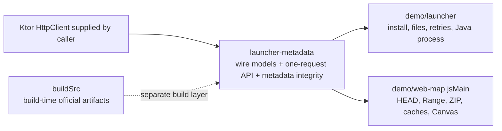

# Mojang Launcher Metadata 公共库实施计划

- 状态：待实施；公共边界已确定
- 记录日期：2026-09-01
- 适用版本：仓库所选择的 Minecraft 官方版本；本计划不改变版本选择
- 计划模块：新增 `:launcher-metadata`
- 迁移调用方：`:demo:launcher` 与 `:demo:web-map`
- 当前范围：官方 version manifest、version metadata、关联 wire models、原始 metadata 完整性校验和调用方迁移

## 1. 目标与结论

新增一个可发布的 Kotlin Multiplatform `launcher-metadata` 模块，统一表示并读取 Mojang 官方 launcher metadata。该模块只负责：

1. 从固定的官方 version manifest endpoint 读取 manifest；
2. 按 manifest 中的 HTTPS reference 读取一个 version metadata 文档；
3. 对 version metadata 的原始响应字节执行 manifest 声明的 SHA-1 校验；
4. 校验返回文档的版本 ID 与 reference 一致；
5. 提供 launcher 和其他调用方需要的完整 wire models，包括 version downloads、libraries、arguments、asset-index reference 与
   asset-index 内容模型；
6. 借用调用方配置的 Ktor `HttpClient`，不创建 engine、不安装插件、不关闭 client，也不添加 retry、cache 或 token policy。

该模块不成为 launcher workflow 或通用下载器。以下能力仍由调用方拥有：

- 安装目录、安装状态、文件替换、断点或重新下载策略；
- client/server/library/asset object 的内容下载；
- 并发、重试间隔、进度和取消后的 UI 状态；
- Java 版本选择、classpath、native extraction、启动参数替换和进程生命周期；
- web-map 的 `HEAD`、HTTP Range、ZIP central directory、64 KiB page cache、无限重试、惰性解压和 Canvas；
- caller-specific metadata 响应大小限制。

实现完成后，两个 demo 不再各自声明 Mojang manifest/version metadata DTO。launcher demo 也不再需要只为内部
`MojangApi` 存在的 Ktorfit/KSP 接入。

## 2. 现状与提取依据

### 2.1 已存在两个独立消费者

`demo/launcher` 当前拥有：

- internal `MojangApi`，读取 manifest、version metadata，并把任意下载 URL 包装为 Ktorfit streaming operation；
- internal `VersionManifest`、`VersionEntry`、`VersionMetadata`、downloads、libraries、arguments、asset index 等模型；
- `InstallationService` 中的 reference ID 校验；
- `ResourceDownloader` 中的文件 SHA-1、长度、临时文件和 atomic move 策略。

`demo/web-map` 当前另外拥有：

- private `PistonVersionManifest`、`PistonVersionReference`、`PistonVersionMetadata` 和 `PistonDownload`；
- 对相同 manifest endpoint 和 reference URL 的浏览器 `fetch`；
- version metadata 原始字节 SHA-1 校验；
- 后续 client JAR `HEAD`/Range 与 ZIP 读取。

共同部分已经不再是单个 demo 的便利代码：它是官方 endpoint、wire schema、reference-to-document 完整性关系和 HTTP client
ownership。安装和 Range 则仍是两个调用方明显不同的应用策略。

### 2.2 已核对的官方 endpoint 事实

实施计划记录时已从实际官方 endpoint 核对：

- `https://piston-meta.mojang.com/mc/game/version_manifest_v2.json` 包含仓库所选版本；
- 对应 manifest entry 提供 version ID、type、URL、SHA-1 和 compliance level；
- version metadata 的 ID 与 reference 一致，并提供 client download URL、SHA-1 和 size；
- 当前文档使用现代 `arguments`，同时公共 wire model 仍需表达 manifest 中其他版本可能出现的 legacy
  `minecraftArguments`；
- metadata 还包含 asset-index reference、libraries 和 Java/logging 信息，launcher demo 已实际消费这些字段。

真实网络检查只作为设计证据，不进入自动测试。仓库 gate 必须继续使用 Ktor `MockEngine`，不得访问 Mojang 服务。

### 2.3 与现有模块的边界

- `account-auth` 只拥有 Microsoft/Xbox/XSTS/Minecraft Services 认证端点；launcher metadata 不是认证，不放入该模块。
- `protocol-model` 只拥有 Minecraft Java protocol 可见模型；launcher metadata 不是游戏连接 wire model，不放入该模块。
- `buildSrc` 继续独立拥有构建期官方 artifact preparation。Gradle build logic 不依赖运行时 subproject，也不迁移到
  `launcher-metadata`。
- `demo/launcher` 仍是应用，不升级成通用 launcher library。
- `demo/web-map` 仍是官方 client JAR Range consumer，不把 archive session 下沉到新模块。



图中的虚线表示二者读取同一类官方上游数据，但不存在 Gradle project dependency 或共享运行时生命周期。

## 3. 新模块布局与依赖

新增：

```text
launcher-metadata/
├── AGENTS.md
├── README.md
├── build.gradle.kts
└── src/
    ├── commonMain/kotlin/com/hiczp/minecraft/launcher/metadata/
    │   ├── MinecraftLauncherMetadataApi.kt
    │   ├── MinecraftVersionManifest.kt
    │   ├── MinecraftVersionMetadata.kt
    │   ├── MinecraftAssetIndex.kt
    │   └── MinecraftArgument.kt
    └── commonTest/kotlin/com/hiczp/minecraft/launcher/metadata/
        ├── MinecraftLauncherMetadataApiTest.kt
        └── MinecraftMetadataModelsTest.kt
```

具体文件可以按最终模型大小微调，但 manifest、version metadata、asset index 和 argument serializer 不应重新聚合成一个无关内容过多的
`Models.kt`。

### 3.1 平台

新模块是无 engine 的公共 HTTP library，平台集合与 `account-auth` 对齐：

- JVM；
- `mingwX64`、`linuxX64`、`linuxArm64`、`macosArm64`；
- iOS、watchOS、tvOS 的现有模拟器和设备 targets；
- Android KMP library；
- Kotlin/JS Node 与 browser；
- Kotlin/WasmJS Node 与 browser。

模块只需要编译这些变体；它不创建 executable，也不替任何调用方选择网络 engine。

### 3.2 依赖

`commonMain`：

- `api(libs.ktor.client.core)`：公开构造函数使用 `HttpClient`；
- `api(libs.kotlinx.serialization.core)`：公开 wire models 可序列化；
- `implementation(libs.kotlinx.serialization.json)`：模块内部 JSON 解码；
- `implementation(libs.okio)`：对原始 metadata 字节执行 SHA-1，并辅助有界读取。

`commonTest`：

- Kotlin test；
- kotlinx-coroutines-test；
- Ktor client MockEngine。

不使用 Ktor ContentNegotiation，也不使用 Ktorfit/KSP。模块以普通 Kotlin API 直接执行 Ktor request，并用自身的
`Json { ignoreUnknownKeys = true }` 解码；调用方不需要为该模块安装插件。

### 3.3 构建注册

- 在 `settings.gradle.kts` 注册 `:launcher-metadata`；
- 在 root `README.md` 的模块表和能力概览中加入该模块；
- 新模块保持自己的 `README.md` 和只含局部规则的 `AGENTS.md`；
- Android namespace 使用 `com.hiczp.minecraft.launcher.metadata`；
- 不增加 generated source、build service、官方 artifact task 或 fixture wiring。

## 4. Wire model 设计

### 4.1 命名与表示原则

公开类型使用足以脱离 demo package 理解的名称，避免 `VersionMetadata`、`Download` 这类过于宽泛的顶层名字。建议基线：

- `MinecraftVersionManifest`；
- `MinecraftVersionReference`；
- `MinecraftVersionMetadata`；
- `MinecraftDownload`；
- `MinecraftAssetIndexReference`；
- `MinecraftAssetIndex` 与 `MinecraftAssetObject`；
- `MinecraftLibrary`；
- `MinecraftArguments`、`MinecraftArgument`、`MinecraftRule`。

只属于一个响应的 subordinate object 优先嵌套在 owner 下，例如
`MinecraftVersionManifest.Latest`、`MinecraftVersionMetadata.JavaVersion`、
`MinecraftVersionMetadata.Logging` 和 `MinecraftLibrary.Downloads`。调用方按仓库规则导入 owner，并通过 owner 引用嵌套类型。

所有 wire carrier 使用 `@Serializable data class`。URL、时间、hash、Maven coordinate、OS 名称和版本 type 保留服务端字符串；不在
wire model 中改成 workflow-specific `Url`、`Instant`、枚举或本地路径。应用需要的解释和筛选继续位于调用方。

### 4.2 Manifest

`MinecraftVersionManifest` 保留：

- `latest.release` 与 `latest.snapshot`；
- 原始顺序的 `versions`。

`MinecraftVersionReference` 保留：

- `id`；
- `type`；
- `url`；
- `time`；
- `releaseTime`；
- `sha1`；
- `complianceLevel`。

实施时重新核对实际 manifest 全集。官方当前始终提供的字段设为 required，不为假想旧响应增加默认值；真正按版本缺失的字段才保持
nullable。 不对版本列表排序、去重、过滤或只保留仓库所选版本。

### 4.3 Version metadata

迁移 launcher 已使用的完整结构，而不是只发布 web-map 所需的 `downloads.client` 投影视图：

- identity/type/main class/assets；
- asset-index reference；
- download members，包括 client，并对官方可能按版本缺失的 server/mapping members 使用准确 nullability；
- libraries、artifact/classifier downloads、rules、natives 与 extract JSON；
- modern game/JVM arguments；
- legacy `minecraftArguments`；
- Java runtime 与 logging metadata。

实施前用仓库所选版本和 manifest 中代表性的 release/snapshot/legacy entries 对照 wire shape。模型只承诺表达官方
metadata，不承诺
`MetadataPlanner` 能启动 manifest 中每一个历史版本；launcher 对不支持的 arguments、native classifier 或 asset layout
仍应显式拒绝。

### 4.4 Arguments 与规则

把现有 JSON-only `MojangArgumentSerializer` 迁移并重命名为 library-owned serializer：

- JSON string 映射为 `MinecraftArgument.Literal`；
- `{ "rules": ..., "value": "..." }` 映射为一个值的 conditional argument；
- `{ "rules": ..., "value": [...] }` 保留原始值顺序；
- 其他 JSON shapes 抛出 `SerializationException`；
- serializer 的 encode 与 decode 对称；
- rule order、action、OS、features 和 version range 均原样保留。

不把 rule evaluation、变量替换或 host platform detection 移入库；这些仍属于 launcher 的 `MetadataPlanner`。

### 4.5 Asset index

`MinecraftAssetIndexReference` 属于 version metadata；`MinecraftAssetIndex` 与 `MinecraftAssetObject` 表示 reference 指向的
JSON 文档。保留 object path 到 hash/size 的映射，以及 `virtual`、`map_to_resources` wire 字段。

新模块第一版不提供“下载全部 asset objects”或“把 asset index 写入磁盘”的 operation。launcher 可继续用自己的 streaming
downloader 取得并持久化原始 asset-index 文件，再用公共 `MinecraftAssetIndex` serializer 解码。

## 5. HTTP API 与完整性语义

建议公开形状：

```kotlin
class MinecraftLauncherMetadataApi(
    private val httpClient: HttpClient,
) {
    suspend fun versionManifest(
        maximumByteCount: Long? = null,
    ): MinecraftVersionManifest

    suspend fun versionMetadata(
        minecraftVersionReference: MinecraftVersionReference,
        maximumByteCount: Long? = null,
    ): MinecraftVersionMetadata
}
```

参数名和最终换行按源码规则整理；这里展示的是语义而不是要求逐字符照抄的源文件。

### 5.1 `versionManifest`

- 固定请求 Mojang 官方 v2 manifest endpoint；
- 每次调用只执行一次 GET；
- 不缓存、不重试、不根据失败切换 host；
- 在响应成功后直接从原始 UTF-8 JSON 字节解码；
- 保留服务端版本顺序；
- `maximumByteCount` 非空时必须为正，并作为调用方提供的流式读取上限；空值表示调用方不设置该策略。

### 5.2 `versionMetadata`

- 要求 reference URL 使用 HTTPS，然后只对该 URL 执行一次 GET；
- 在解码前对原始响应字节计算 SHA-1，与 reference 声明值进行大小写不敏感的十六进制比较；
- hash 不匹配时绝不把响应解码或返回；
- hash 成功后解码，并要求 `minecraftVersionMetadata.id == minecraftVersionReference.id`；
- 不自动读取 asset index、client JAR、libraries 或其他 reference；
- `maximumByteCount` 语义与 manifest 相同。

大小上限由调用方显式提供，库中不设置共享的 8 MiB 或其他 policy constant。读取实现同时使用 `Content-Length`（存在时）做早期拒绝并在
streaming body 上实际计数，不能只相信 header。

### 5.3 HttpClient 与失败

- API 借用 constructor 中的 `HttpClient`，从不关闭它；
- 不创建 engine，不安装 ContentNegotiation、timeout、retry、cache 或 logging plugin；
- 每个 request 显式要求成功 HTTP status；非 2xx 保留 Ktor response exception；
- transport、TLS、engine、serialization 和 cancellation failures 保留其原始类别；
- 不使用 broad `catch` 把 `CancellationException` 转成 metadata failure；
- 定义精确的 metadata integrity exception，区分 malformed reference SHA-1、response SHA-1 mismatch 和 decoded version-ID
  mismatch；
- 定义或复用精确的 response-size failure，报告 caller limit 与已观察字节数，不包含响应正文；
- 错误消息、KDoc 和源码注释使用英文。

## 6. `demo/launcher` 迁移

### 6.1 依赖与构造

- `commonMain` 增加 `implementation(project(":launcher-metadata"))`；
- 删除 `MojangApi.kt`；
- `Main.kt` 用共享 `HttpClient` 构造 `MinecraftLauncherMetadataApi`；
- `InstallationService` 接收该 API，并使用 `versionManifest()` 与 `versionMetadata(minecraftVersionReference)`；
- 删除 `InstallationService` 中重复的 decoded ID 校验，因为新 API 在完整性边界已经完成；
- API 和 downloader 均只借用 launcher-owned `HttpClient`，最终仍由 `Main.kt` 关闭一次。

### 6.2 Wire models

从 demo 的 `Models.kt` 删除并改为导入公共模型：

- manifest/reference；
- version metadata/downloads；
- asset-index reference/content；
- libraries/rules/arguments 及 serializer。

以下类型继续留在 demo：

- `InstalledState`、`InstalledVersion`；
- `AuthState`、`StoredAccount`；
- `DownloadSpec`、`InstallPlan`、`LaunchPlan`；
- progress、output 和 UI state。

`MetadataPlanner` 继续把公共 wire model 转为严格的 demo-owned `InstallPlan`，继续拥有 OS/rule
evaluation、路径校验、classpath、native 和 placeholder policy。

### 6.3 Resource downloading

`ResourceDownloader` 不再经由 metadata API 的通用 `download(url)`：

- 直接借用 launcher `HttpClient` 并使用 Ktor streaming GET；
- 保留当前 Okio temporary sibling、streaming SHA-1、size check、atomic move 和 caller retry；
- 不把 `ResourceDownloader` 或 `DownloadSpec` 放入新模块；
- 不改变当前下载并发、重试间隔或安装状态转换。

### 6.4 删除不再需要的构建依赖

完成迁移并确认仓库没有其他使用者后：

- 从 `demo/launcher` 删除 Ktorfit plugin、Ktorfit library 和仅由 Ktorfit 使用的 KSP plugin；
- 若 launcher 不再需要 Ktor ContentNegotiation，删除该 plugin 配置及对应两项依赖；
- 从 root `build.gradle.kts` 删除 Ktorfit `apply false` declaration；
- 从 version catalog 删除 Ktorfit version、library 和 plugin alias；
- 保留 root KSP declaration，因为其他模块仍使用 KSP；
- 更新 lockfiles 只通过正常 Gradle/npm resolution，不手工编辑。

### 6.5 Launcher 测试迁移

- 现有 mock manifest 的 reference SHA-1 必须继续由 metadata 原始 bytes 计算；
- request-count assertions 保持 manifest 与 metadata 每次各一个 request；
- 增加 metadata hash mismatch 和 ID mismatch 通过 library API 传播到 controller/install failure 的场景；
- 保留 content download 重试、并发、取消、文件发布和启动计划测试，证明公共 metadata 提取没有改变应用策略。

## 7. `demo/web-map` 迁移

### 7.1 依赖与生命周期

- 只在 `jsMain` 增加 `implementation(project(":launcher-metadata"))`，不把生成或 HTTP metadata 依赖暴露给 RPC
  `commonMain`；
- `BrowserMain` 使用页面级现有 `HttpClient` 构造 `MinecraftLauncherMetadataApi`；
- 把 API 传入 `OfficialAssetSessionManager`/`OfficialAssetSession.open`；
- 页面关闭时仍只由 `BrowserMain` 关闭共享 `HttpClient`；asset session 不关闭它。

### 7.2 Metadata phase

保留当前 Phase 1 的 UI 顺序和英文进度文本，但把前两步改为公共 API：

1. `versionManifest(MAX_METADATA_BYTES)`；
2. 从 manifest 精确选择 `MinecraftProtocol.MINECRAFT_VERSION`；
3. `versionMetadata(reference, MAX_METADATA_BYTES)`，由库完成原始字节 SHA-1 和 ID 校验；
4. 从公共 metadata 取得 client download descriptor；
5. 继续进入 demo-owned HEAD/Range/ZIP phase。

`MAX_METADATA_BYTES` 留在 web-map，作为该页面的调用方 policy。公共模块只执行传入的限制。

### 7.3 删除重复代码

从 `OfficialAssetSession.kt` 删除：

- `PistonVersionManifest`、`PistonVersionReference`、`PistonVersionMetadata`、`PistonDownloads`、`PistonDownload`；
- manifest endpoint constant；
- 只为 metadata 使用的 `fetchBytes`、UTF-8 decode 与 Web Crypto SHA-1 helper；
- 与公共 API 重复的 version-ID/reference hash 检查。

保留：

- client download HTTPS check；
- HEAD `Content-Length` 与 metadata size 对照；
- `bytes=0-0` Range probe；
- parsed ZIP metadata、真实 entry offset、disjoint span merging、64 KiB pages；
- 每页两秒无限重试、session cancellation、compressed page cache、lazy decompression 和 decoded resource caches；
- `AssetJson`，因为 blockstate/model/texture metadata 解析仍是 demo-owned resource rendering。

### 7.4 取消与错误传播

- `loadJob.cancel()` 负责取消进行中的 Ktor metadata request；
- browser `AbortController` 继续负责 HEAD、Range 和 zip.js reader 使用的原生 fetch；
- metadata integrity/size/HTTP failure 继续进入 Phase 1 的同源显式 retry UI；
- retry 重新执行同一官方 manifest/API 路径，不引入备用 host；
- asset session cleanup 保持 cancellation 为 primary failure，并附加 cleanup failure。

## 8. 文档与指导文件

### `launcher-metadata/README.md`

记录当前公共契约：

- 模块读取哪两个 metadata stages；
- caller-owned `HttpClient`；
- manifest reference 到 version metadata 的 SHA-1/ID 完整性；
- wire model 示例；
- caller-supplied `maximumByteCount`；
- 明确不负责下载、安装、重试、缓存、文件系统或 Java 启动。

示例中的 `HttpClient` 必须由参数或局部声明提供；不要展示模块创建 engine 或关闭调用方 client。

### `launcher-metadata/AGENTS.md`

只保留局部规则：

- 固定官方 manifest endpoint；
- 每个 public operation 至多一个 HTTP request；
- reference URL 只允许 HTTPS；
- raw bytes hash 先于 JSON decode；
- wire strings 不改造成 workflow values；
- no retry/cache/engine/plugin/client close；
- no installer/filesystem/Range；
- MockEngine-only tests。

### 调用方文档

- launcher README 改为使用公共 metadata API，同时继续说明安装和启动属于 demo；
- web-map README 说明 Phase 1 的 manifest/version metadata 由 `launcher-metadata` 读取和校验，Range/ZIP 仍完全在浏览器
  demo；
- root README 更新模块表和最短入口链接；
- 文档只使用“仓库所选择的版本”等 owner-based 表述，不复制版本 selector literal。

## 9. 分阶段实施顺序

### 阶段 A：建立模块与模型

1. 注册 `:launcher-metadata` 并创建 KMP build；
2. 编写局部 README/AGENTS；
3. 从 launcher 模型逐项建立公共、完整命名的 wire models；
4. 对照实际官方 manifest、仓库所选 metadata 和代表性历史 metadata 校准 required/nullable fields；
5. 迁移 argument serializer 并完成纯 serialization tests。

完成门槛：新模块独立编译，fixtures 可无 demo 依赖地完成 manifest、metadata、arguments 和 asset-index round trip。

### 阶段 B：实现 HTTP 与 integrity boundary

1. 实现 fixed manifest GET；
2. 实现 reference-driven metadata GET；
3. 实现 caller-owned optional byte limit；
4. 在 JSON decode 前验证原始 SHA-1；
5. 验证 decoded version ID；
6. 完成 HTTP、hash、size、JSON、ID 和 cancellation tests。

完成门槛：MockEngine 证明每个 operation 恰好一个 request，任何 integrity failure 都不会返回 decoded metadata。

### 阶段 C：迁移 launcher

1. 替换 API 与模型 imports；
2. 让 downloader 直接使用 `HttpClient`；
3. 删除 demo-local Mojang API/wire DTO；
4. 删除 Ktorfit/KSP/ContentNegotiation 的无用 wiring；
5. 更新 launcher tests 与 README。

完成门槛：launcher 的 manifest、install、validate、controller 和 planner tests 全部通过，下载/进程策略无变化。

### 阶段 D：迁移 web-map

1. 注入公共 API；
2. 保留并传入 demo 的 metadata byte limit；
3. 删除 private Piston DTO 与 metadata fetch/hash helpers；
4. 保持 Range/ZIP/cache 与 UI phase 行为；
5. 更新 JS tests、browser distribution 和 README。

完成门槛：production bundle 只保留一套 launcher metadata model，真实浏览器 Phase 1 仍能从官方 endpoint 进入地图阶段。

### 阶段 E：仓库清理与验证

1. 清理 version catalog/root plugin 中已无引用的 Ktorfit 项；
2. 搜索确认不存在 private manifest/version metadata 复制品；
3. 更新 root/module documentation；
4. 执行窄测试、平台测试、配置缓存检查和最终 JVM suite。

## 10. 测试矩阵

### `launcher-metadata` common tests

- exact manifest endpoint、GET method 和一次请求；
- manifest latest/entries 的完整字段与顺序；
- unknown JSON fields 被忽略，required fields 缺失正常失败；
- modern literal/conditional single/conditional list arguments 双向序列化；
- libraries、rules、classifiers、asset-index snake_case 字段；
- metadata reference URL 非 HTTPS 在请求前失败；
- metadata 原始 bytes SHA-1 成功；
- hash 大小写不影响比较；
- malformed expected SHA-1、mismatch、ID mismatch 分别失败；
- optional size limit 的小于、等于、超过边界，以及错误 `Content-Length` 不能绕过实际计数；
- non-2xx、transport、malformed JSON 和 cancellation 保留类别；
- API operation 后 caller `HttpClient` 仍可使用。

### Launcher regression tests

- manifest loading 与 UI failure state；
- metadata lookup、install plan 和 installed metadata reload；
- asset index、client、library、asset object downloads；
- file hash/size、temporary publication、retry、concurrency 和 cancellation；
- rule/argument planning 与 unsupported legacy behavior；
- metadata integrity failure 不开始后续 content downloads。

### Web-map regression tests

- pure asset range/page/model tests保持不变；
- shared metadata model selection 可在 `launcher-metadata` common tests 覆盖，不在 Node test 访问网络；
- JS production distribution 不包含 demo-local Piston DTO 实现；
- 人工真实浏览器检查验证 official manifest → verified metadata → HEAD/Range → ZIP indexing → map phase；
- 真实网络检查不是仓库 gate。

## 11. 验证命令

所有 Gradle 调用顺序执行，先运行最窄 JVM path：

```shell
./gradlew :launcher-metadata:jvmTest
./gradlew :demo:launcher:jvmTest
./gradlew :demo:web-map:jvmTest
./gradlew :demo:web-map:jsNodeTest
```

随后验证公共模块的 portable Web variants 和浏览器产物：

```shell
./gradlew :launcher-metadata:jsNodeTest
./gradlew :launcher-metadata:wasmJsNodeTest
./gradlew :demo:web-map:jsBrowserDistribution
```

在当前 host 上编译或测试相关 Native target，并对至少一组受影响任务执行 configuration-cache store/reuse。最后运行：

```shell
./gradlew :minecraft-test-fixture-host:test jvmTest
```

若 repository-wide fixture 失败，按既有 ownership 判断是否与本次 metadata 改动相关；不得通过改变 endpoint、模型或错误语义掩盖外部
fixture 问题。

## 12. 完成标准

1. `:launcher-metadata` 是有 README、AGENTS、完整平台声明和公共 Kotlin API 的独立 runtime module。
2. API 只借用调用方 `HttpClient`，每次 operation 只进行一次请求，不创建 engine、不安装插件、不关闭 client。
3. version metadata 在 JSON decode 前通过原始字节 SHA-1，并在返回前通过 version-ID 校验。
4. 调用方可以显式提供 metadata 最大字节数；库中没有共享 policy-sized magic limit。
5. 公共 wire models 足以覆盖 launcher 现有 manifest、metadata、libraries、arguments 和 asset-index 路径。
6. `demo/launcher` 不再包含 `MojangApi` 或重复 wire models；安装、下载、重试、文件和进程策略仍在 demo。
7. `demo/web-map` 不再包含 private Piston manifest/version DTO 或 metadata SHA-1 helper；HEAD、Range、ZIP、缓存和渲染仍在
   demo。
8. Ktorfit 及其 launcher-only KSP/ContentNegotiation wiring 在无其他消费者后被完整移除，root KSP 能力保留。
9. 自动测试全部使用 MockEngine/fixtures，不访问官方服务或凭据。
10. JVM、JS Node、WasmJS Node、browser distribution 和当前 host 的适用 Native 编译通过；文档与实际依赖图一致。

## 13. 明确不随本计划实施的事项

- 通用 Minecraft launcher、安装器或进程管理 library；
- Microsoft/Xbox/Minecraft account authentication 的重构；
- 官方 client/server JAR、libraries 或 asset objects 的公共 downloader；
- HTTP retry/cache/resume/rate-limit policy；
- persistent metadata cache 或离线 manifest；
- web-map Range reader、ZIP parser、资源包模型、texture decoder 或 Canvas renderer 下沉；
- buildSrc 改为依赖 runtime module；
- 为历史版本加入兼容 shim、deprecated aliases 或宽松的假定默认值；
- live official endpoint 自动化测试。
