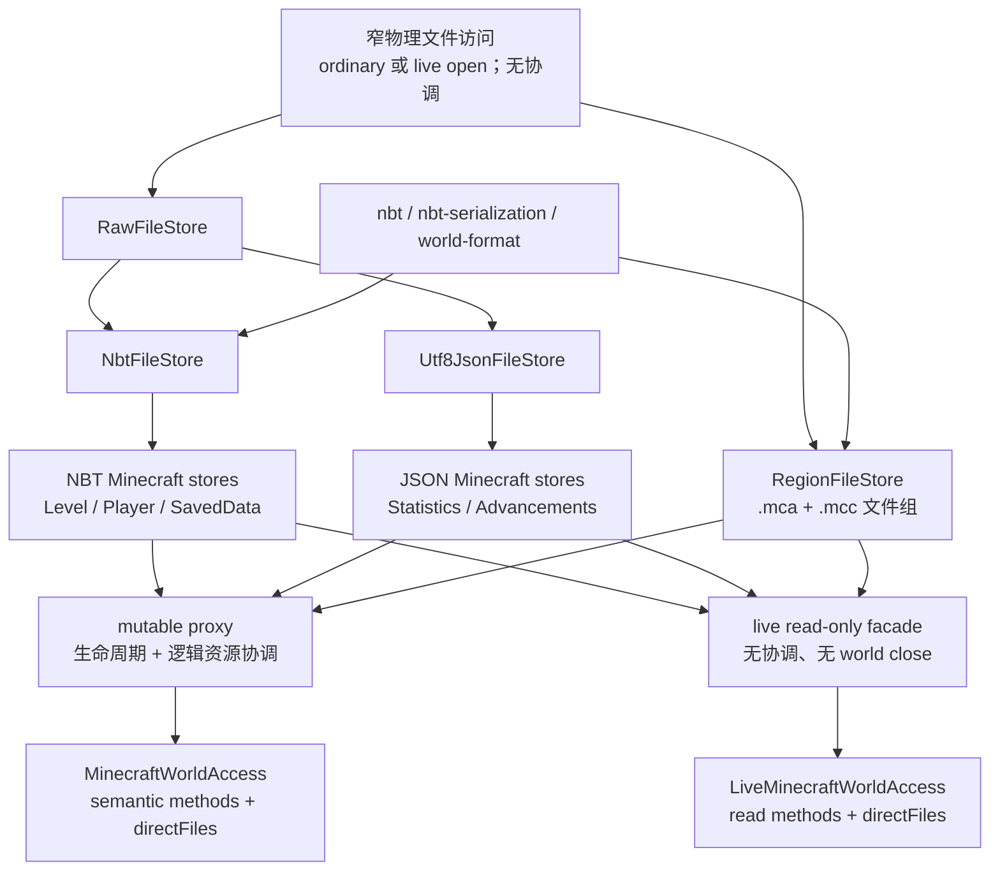

# `world-io` 无状态存储分层与双路线重构计划

- 状态：已完成；定向 JVM/JS、官方互操作与仓库 `allTests` gate 均已通过
- 记录日期：2026-08-28
- 适用版本：仓库所选择的 Minecraft 官方版本；本计划不改变版本选择
- 计划模块：`:world-io`；不新增 Gradle 运行时模块
- 相关计划：[Minecraft 网页地图 Demo](minecraft-web-map-demo.md)

## 1. 目标与已确定结论

本次重构重新整理 `world-io` 的存储 API，使用户既能直接使用无状态底层工具，也能选择带世界生命周期和
程序内读写协调的高阶入口。纵向按职责逐层封装，横向明确区分 mutable 与 live read-only 两条路线。

已经确定的结论如下：

1. 所有实现继续留在 `world-io`。增加清晰的类和源文件是允许的，但不为小适配器或分层本身创建新模块。
2. “无状态”指对象不持有会随操作变化的共享运行状态、协调器、引用计数、资源 registry 或 world close 状态；持有不可变的
   `FileSystem`、路径、格式和写入配置不破坏无状态性。
3. 底层公开工具接受调用方给出的精确 `Path`，提供 raw、standalone NBT 和 UTF-8 JSON 的流式及完整值读写。用户可以绕过
   高阶入口直接使用这些工具，此时并发、生命周期和路径安全完全由调用方负责。
4. Minecraft 文件策略层在底层格式工具上增加路径理解和该文件固有的写入策略，例如 `level.dat` 的临时文件与
   `level.dat_old` 替换、player data 的备份、saved data scope，以及 Region 的 `.mca`/`.mcc` 文件组。
5. mutable 高阶入口 `MinecraftWorldAccess` 是“无状态 store + world 生命周期 + 逻辑资源协调器”的代理。其
   `readLevelData`、`writePlayerData` 等语义方法使用逻辑键取得共享读或独占写 admission。
6. live 高阶入口 `LiveMinecraftWorldAccess` 只读，不取得 `session.lock`，不创建程序级协调器、registry 或引用计数器；它直接
   复用只读的无状态 store，Region handle 继续由调用方独立拥有。
7. 两条高阶路线都提供 `directFiles`。mutable 版本支持读写，live 版本只暴露读取；两者都可读取 raw、NBT 与 JSON。
8. mutable `directFiles` 不取得任何逻辑资源键，也不与语义方法或其他 direct 操作互斥；它只取得 world active-operation pin，
   使 `close()` 必须等待已开始的操作完成及资源关闭。
9. `directFiles` 不设置路径 allowlist/denylist，不禁止访问 `session.lock`，也不限制路径必须位于 world root 下。传入的
   `Path`
   不被重新解释；需要世界内路径时，调用方从 `minecraftWorldPaths.root` 或其标准路径属性构造。由此产生的竞态或破坏性结果由
   调用方负责。
10. 不实现协调型 `FileSystem` delegate。协调发生在完整语义操作边界，不发生在 `source`、`sink`、`move` 等单个文件系统调用上。
    保留现有窄 `WorldFileAccess`，只让它负责 ordinary/live 的物理打开差异和写能力检查，不得取得逻辑锁。
11. 保留 `RequiresExclusive` 机制：mutable 的共享读发现必须执行 `_old` fallback、promotion 或损坏副本保存时，释放共享
    admission 后取得独占 admission，再执行完整读取与恢复流程；绝不在持有共享锁时原地升级。
12. `_old` 是上一份存储快照，不是旧格式文件。库不提供 DataFixer，不升级历史 schema，也不把 `DataVersion` 与仓库或调用方
    指定版本比较后拒绝读取；它直接尝试解析并保留该字段，结构本身无法解析时才按 codec 契约失败。除 level/player 已确定的 官方式
    fallback 外，不增加通用损坏文件猜测、隔离或修复框架。
13. `SavedDataFileStore` 直接改名为 `SavedDataStore`，不保留 deprecated alias 或兼容包装。
14. 这是早期项目的直接重构。旧的偶然分层、内部类和调用路径可以删除，不引入过渡期双实现。
15. `world-io` 的 public/protected 文件系统类型、callback 流和 I/O 异常只使用 Okio；只在调用 filesystem-independent lower
    layer 时通过官方 `kotlinx-io-okio` adapter 转换，不手写字节搬运或自行构造替代异常。终端 parser/serializer
    没有可反向适配的返回流，因此其失败出口只在捕获到 kotlinx-io `IOException` 时借官方反向 adapter 映射。
16. callback-bound source/sink 是字节层面的主路径；document、typed serializer、text/element 等完整值入口直接封装该流，不先
    组装完整 byte array、string 或格式树。Region 写入因 Anvil 分配必须先知道压缩后长度，可保留唯一一份最终压缩结果，但不再
    同时保留完整未压缩中间结果；已知压缩长度的入口直接流式写入。
17. 后续确认纳入的强类型范围包括 `PlayerData`、维度 saved-data 的 `world_border`/`chunk_tickets`/`raids`/
    `ender_dragon_fight`，以及可变的 POI Chunk/Section/record 领域模型。它们属于 `world-format`；`world-io` 只负责路径、流和
    文件策略。
18. `level.dat` 与 `players/data/<uuid>.dat` 复用一个 primary/previous NBT 物理机制，但保留官方不同的恢复结果：level 成功读取
    previous 后 best-effort 提升，player 只回退读取且不提升；两份 player 数据都不可用时返回空。
19. mutable/live 两侧为 level、player、saved data、Chunk/Entity/POI Region 提供同名同参数的读取形态；差异只来自
    suspend、写入、协调、close 和资源所有权。强类型 shortcut 只调用一次通用 serializer 路径，不形成第二套行为。
20. 对仓库所选择布局的维度目录，`region`、`entities`、`poi` 和 `data` 四类内容均有 mutable 协调入口与 live 读取入口； POI
    handle 自己持有无额外上下文的 codec，调用方不重复传入。

## 2. 明确不做的事情

- 不改变 `nbt`、`nbt-serialization` 和 `world-format` 的格式所有权，也不把文件系统代码下沉到这些模块。
- 不新增 `world-storage-core`、`world-storage-adapter` 或其他小运行时模块。
- 不创建拦截所有 Okio 调用的 `FileSystem` 代理，也不依赖路径字符串猜测逻辑资源。
- 不让 live 路线写入任何文件，不为 live 读取增加 `session.lock` 或程序内读写协调。
- 不让 Okio `BufferedSource`、`BufferedSink`、Region read scope 或 replacement scope 逃逸出其回调/资源生命周期。
- 不承诺 `directFiles` 与语义 API 之间的一致性，也不在 direct 操作之间隐式串行化同一路径。
- 不禁止用户通过低层 store 或 `directFiles` 访问 world 目录外、`session.lock`、`.mca`、`.mcc` 或任何其他文件。
- 不实现跨进程快照、事务、文件观察、DataFixer、旧 schema 迁移或通用损坏数据恢复。
- 不把官方的多步备份替换描述为整个操作原子；只保证每一步失败时本库定义的清理和 rollback 不变量。
- 不为存储分层改变 Chunk、Entity、NBT 或 JSON 的既有语义；后来明确加入的 PlayerData、维度 saved-data 与 POI 模型是独立的
  filesystem-independent 扩展。

## 3. 已核对的重构前现状与问题

### 3.1 重构前已有可复用基础

- `NbtFileStore` 已经提供 arbitrary `Path` 上的 `NbtDocument`、调用方 serializer 和流式读写，并支持显式
  `Compression`。
- `Utf8JsonFileStore` 已经提供 arbitrary `Path` 上的 UTF-8 text、`JsonElement`、调用方 serializer 和流式读写。
- `LevelDataStore`、`PlayerDataStore` 与 `SavedDataFileStore` 都把 NBT 物理编解码委托给 `NbtFileStore`；它们没有必要 重新实现
  NBT 格式。
- `MinecraftWorldPaths` 已拥有 level、player、statistics、advancements、saved data、Region 与 sidecar 的标准路径知识。
- `LogicalFileAccess` 已实现 writer-preferring shared-read/exclusive-write admission。
- `MinecraftWorldAccess` 已持有 `session.lock`，并通过 `OpenMinecraftWorld` 管理 metadata/Region active-operation pins 与
  close barrier。
- `LiveMinecraftWorldAccess`、`LiveRegionHandle` 和平台 `openLiveReadOnly` 已定义读取正在变化的世界时所需的物理打开语义。

### 3.2 重构前混合职责

- `OpenMinecraftWorld` 同时承担公开方法的实际实现、world close 状态、metadata key registry、读写 admission、Region storage
  registry 和 store 组装，职责过多。
- `RegionStorage` 同时包含 Region 文件组 I/O、`MutableRegionFile` 生命周期、每 Region 引用计数、逻辑读写 admission 和自身
  close barrier，导致低层 Region 能力无法脱离 mutable 高阶入口独立使用。
- `WorldFileAccess` 同时被多个 store 直接引用；它目前没有协调逻辑，但名称和位置容易让后续实现把协调继续下沉。
- statistics 与 advancements 的路径策略直接散落在两个 world access 中，而没有与 Level/player/saved data 对称的无状态
  store。
- 高阶入口没有统一的 arbitrary-file API；调用方只能完全绕过 world access 构造 store，无法在绕过逻辑锁的同时参加 world
  close 屏障。
- mutable 的显式 data-pack 读取目前也没有统一参加 world active-operation 生命周期；高阶入口上发生的文件工作应在 world
  close 前完成，即使该资源按策略不使用逻辑键。

### 3.3 `_old` 与 `RequiresExclusive` 的真实含义

对仓库所选择版本的官方 client/server 写入路径核对后，结论是：

- level data 和 player data 都先在相同目录写入临时文件，再调用官方 safe-replace 流程。
- safe-replace 删除旧 backup，把当前文件 move/rename 为 `_old`，再把临时文件 move/rename 为当前文件；失败时进行检查、重试和
  必要的 old-to-current rollback。它不是 copy，也没有把整个三步过程变成单个事务。
- 因此正常退出后同时存在 `.dat` 与 `.dat_old` 是预期行为；`_old` 保存上一份内容。
- 官方 level 读取会在当前文件失败时使用 previous 文件并尝试提升它；一旦 previous 已成功解析，提升的布尔失败会被忽略，读取
  仍返回该值。官方 player 读取会备份损坏的当前文件、尝试 `.dat_old`，但不提升 `.dat_old`，两份都不可用时返回空并允许进程 继续。
- 本次实现中的 `RequiresExclusive` 正是在共享读检测到上述恢复可能产生写入时，要求高层重新以独占方式执行；它不是格式升级流程。

本次重构保留这一语义和相关互操作测试，同时把它与“历史 schema/DataVersion 升级”明确分开。

## 4. 目标分层与依赖方向

高层只依赖更低层能力。mutable 与 live 在高层分叉，但复用相同的格式工具、路径规则和尽可能多的文件策略。下图箭头表示
“低层能力被上层组装”，不是运行时调用方向。



### 4.1 格式与模型层

- `nbt` 继续拥有 NBT value algebra 与 `NbtDocument`。
- `nbt-serialization` 继续拥有 binary NBT/SNBT 与 kotlinx serialization format。
- `world-format` 继续拥有 standalone world schemas、Anvil framing、压缩、Region/Chunk/Entity 语义。
- 这些层不知道 `Path`、`FileSystem`、`session.lock`、world lifecycle 或逻辑资源键。

### 4.2 物理文件访问层

保留现有 `WorldFileAccess` 作为窄内部能力，只负责：

- 持有 `FileSystem`；
- ordinary read 与 live read-only 打开方式的物理差异；
- mutable 写能力检查；
- 确保 Okio handle/source/sink 以项目统一的失败组合方式关闭。

它不实现 `FileSystem`，不解析 Minecraft 路径，不持有协程锁，不知道 `RequiresExclusive`，也不参加 world close。平台
`expect`/`actual` 继续只暴露 `openLiveReadOnly`、durable flush 等不可避免的最小原语。

### 4.3 通用无状态文件工具层

新增公开 `RawFileStore`，并让现有格式 store 组合它：

| Store               | 职责                                                                                 | 明确不负责                             |
|---------------------|--------------------------------------------------------------------------------------|----------------------------------------|
| `RawFileStore`      | arbitrary `Path` 的 callback-bound raw source/sink、bytes 读写和直接 truncate/create | Minecraft 路径、格式、backup、协调     |
| `NbtFileStore`      | standalone unnamed-root NBT、显式压缩、`NbtDocument`、serializer、流式 NBT           | level/player/saved-data 路径与替换策略 |
| `Utf8JsonFileStore` | UTF-8 text、`JsonElement`、serializer、流式 JSON                                     | statistics/advancements 路径与逻辑键   |

要求：

- 三者公开提供基于 `FileSystem` 的普通构造方式，供用户完全独立使用。
- 高阶 mutable/live 组装时使用内部物理访问构造方式，以复用 ordinary/live 的正确打开语义；不要复制格式实现。
- read/write callback 使用 Okio `BufferedSource`/`BufferedSink`，并在 callback 返回前消费、flush 和关闭；完整值 helper
  委托给同一条流式路径，并把选定 serializer 直接连接到借用流。仅在内部调用 lower format API 时使用官方
  `kotlinx-io-okio` adapter，不建立完整 byte array、string 或格式树中间表示。
- NBT 写入保留明确的 compression 参数和当前 durable-write 契约；JSON/raw 的直接写是 final-path truncate，不偷偷使用
  level/player backup 策略。
- 调用方直接构造这些 store 时，不取得 `session.lock`、不使用协调器，也不参加任何 `MinecraftWorldAccess.close()`。

### 4.4 Minecraft 路径与文件策略层

该层仍然无共享运行状态。每个 store 只持有不可变路径、格式工具和写入配置，并公开 document/text、serializer 及流式入口。

| Store                     | 拥有的策略                                                                                     |
|---------------------------|------------------------------------------------------------------------------------------------|
| `LevelDataStore`          | `level.dat` + `level.dat_old`、临时文件、safe replacement、read fallback/best-effort promotion |
| `PlayerDataStore`         | 每 player UUID 的 `.dat` + `.dat_old`、临时文件、损坏 current 副本与只读 fallback              |
| `SavedDataStore`          | identifier 校验、world-root/dimension scope、压缩探测、saved-data 直接 synced write            |
| `PlayerStatisticsStore`   | player UUID → statistics JSON 路径与 text/serializer 操作                                      |
| `PlayerAdvancementsStore` | player UUID → advancements JSON 路径与 text/serializer 操作                                    |
| `WorldDataPackReader`     | world `datapacks` 下 directory/ZIP 路径与只读 archive/content 逻辑                             |
| `RegionFileStore`         | Region directory、`.mca` 与其 `.mcc` sidecars 组成的一个逻辑文件组及物理打开策略               |

`SavedDataFileStore` 在此阶段直接改为 `SavedDataStore`。同时新增明确的 `SavedDataScope`：

- `SavedDataScope.WorldRoot` 对应 world root 下的 `data`；
- `SavedDataScope.Dimension(dimensionDirectory)` 对应指定维度目录下的 `data`。

通用 saved-data API 必须显式接收 scope，不再用一个默认 `DimensionDirectory` 掩盖两类不同位置。针对已知原版文件的高阶
shortcut 可以在实现内部固定正确 scope。identifier 仍由 `MinecraftWorldPaths` 校验和解析，Demo 或调用方不拼接
`data/minecraft/*.dat` 字符串。

### 4.5 Region 文件组层

把当前 `RegionStorage` 分成两部分：

1. 无状态 `RegionFileStore` 负责目录/文件组定位、打开现有或创建新 Region、`.mca` 与外部 `.mcc` sidecar 的成组 I/O，复用
   `MutableRegionFile`、Anvil allocator 和共享 read scope core。
2. mutable 高层的 coordinated Region registry 负责每个逻辑 Region 的 users、closing、opened file、writer-preferring
   admission 和 world close barrier。

`RegionFileStore` 向直接用户提供 callback-bound 的 uncoordinated Region 操作：方法在一次调用中打开资源、借出 batch scope，
并在返回前完成 flush/close；store 本身不缓存、不共享、不计数。打开文件对象当然具有局部资源状态，但它只属于该 callback 的资源
生命周期，不是 store 的共享状态。供高阶 registry 使用的内部 open primitive 可以把同一物理实现交给 coordinated handle，不能
另写一套 `.mca`/`.mcc` 规则。live handles 同样复用该文件组核心。

一次性方法的资源生命周期按调用划分：调用方先读 Header、再单独读内容会自然产生两次打开，这是可接受且可观察的 API 组合结果，
不为此增加跨调用缓存。同一个语义方法内部则复用已经打开的 source/handle，例如 saved-data 的压缩探测和解析不得自行打开两次。

保留两种上层资源语义：

- mutable `RegionHandle`/`EntityRegionHandle`/`PoiRegionHandle` 加入 coordinated registry，方法是 suspend，close 等待已
  admitted 操作；
- `LiveRegionHandle`/`LiveEntityRegionHandle`/`LivePoiRegionHandle` 继续 caller-owned、同步 close、彼此完全独立，并使用
  live-open 物理语义。

不要为了表面对称强迫两种 handle 实现同一接口；它们的 suspend/同步、写能力和 close 契约本来就不同。只复用下层文件组、
framing、compression 和 scope 实现。

### 4.6 mutable 生命周期与逻辑资源协调层

从 `OpenMinecraftWorld` 提取两个正交的内部部件：

- `WorldOperationLifecycle`：sealed/open/closing 状态、active-operation pins、close completion、cleanup failure 汇总，以及最后释放
  `session.lock` 的顺序；
- `LogicalResourceCoordinator<Key>`：按逻辑键建立 writer-preferring shared-read/exclusive-write admission，并在最后一个用户
  离开时移除 entry。

最终删除职责混杂的 `OpenMinecraftWorld`，由 `MinecraftWorldAccess` 组合这两个部件、无状态 stores 和 coordinated Region
registry。协调顺序固定为：

1. 取得 world operation pin；
2. 如该语义需要，取得一个逻辑资源的 read/write admission；
3. 调用无状态 store 完成完整文件策略；
4. 释放逻辑 admission；
5. 在不可取消清理中释放 operation pin。

全局 bookkeeping mutex 内不得执行 I/O、codec、等待另一个 admission 或关闭资源。一个普通 metadata 操作只取得一个逻辑键；
Region registry 继续遵守 logical admission 在前、file-open mutex 在后的锁顺序。

### 4.7 高阶 API 层

`MinecraftWorldAccess` 和 `LiveMinecraftWorldAccess` 保持用户主要入口，主体 API 是已知文件的语义方法，而不是暴露协调器或内部
store：

- level data：document、caller serializer/reified type、stream；mutable 另有对应写入；
- player data：同上，按 player UUID；
- saved data：同上，identifier + 显式 scope；
- statistics/advancements：text、`JsonElement`/caller serializer、stream；mutable 另有对应写入；
- data packs：inspection/archive/content 高阶读取；
- Chunk/Entity/POI Region：list/has/open 与相应 handle；
- `directFiles`：arbitrary exact `Path` 的 flat raw/NBT/JSON API。

高阶方法调用下层 store，不重新实现 compression、serialization、路径拼接、temporary replacement 或 Region framing。mutable 方法
是 suspend，live 方法保持同步只读；不为两者创建一个削弱语义的共同高阶接口。

## 5. 重构前类型到最终类型的编排

| 重构前类型/文件                             | 最终处理                                                                               |
|---------------------------------------------|----------------------------------------------------------------------------------------|
| `WorldFileAccess`                           | 保留现有名称和窄内部物理职责；禁止加入协调职责                                         |
| `FileIO.kt` 内 raw helpers                  | 提炼为公开 `RawFileStore`，内部 helper 只保留平台/失败组合细节                         |
| `NbtFileStore`                              | 保留公开类型，改为组合 raw/physical 层；继续允许 arbitrary exact `Path`                |
| `Utf8JsonFileStore`                         | 保留公开类型，改为组合 raw/physical 层；继续允许 arbitrary exact `Path`                |
| `StandaloneFileStores.kt`                   | 按所有权拆为独立源文件；不是拆 Gradle 模块                                             |
| `LevelDataStore`                            | 保留，明确 read-only fallback、shared probe、exclusive recovery 与 write policy        |
| `PlayerDataStore`                           | 保留，明确 read-only fallback、shared probe、exclusive recovery 与 write policy        |
| `SavedDataFileStore`                        | 直接改名为 `SavedDataStore`，加入显式 `SavedDataScope`，无 alias                       |
| access 内直接拼接的 statistics/advancements | 提取为 `PlayerStatisticsStore` 与 `PlayerAdvancementsStore`                            |
| `RegionStorage`                             | 拆为无状态 `RegionFileStore` 与 mutable-only coordinated Region registry               |
| `OpenMinecraftWorld`                        | 拆为 world lifecycle、logical coordinator、Region registry 和 facade delegation 后删除 |
| `MinecraftWorldAccess`                      | 保持 public mutable facade，增加 `directFiles`，所有高阶文件操作参加 world lifecycle   |
| `LiveMinecraftWorldAccess`                  | 保持 public live read-only facade，增加只读 `directFiles`，不增加 close/coordinator    |

## 6. `directFiles` 的精确契约

### 6.1 入口与方法族

两个 access 都公开名为 `directFiles` 的属性，但类型和能力不同：

- `MinecraftWorldAccess.directFiles: MinecraftWorldDirectFiles`：suspend raw/NBT/JSON read/write；
- `LiveMinecraftWorldAccess.directFiles: LiveMinecraftWorldDirectFiles`：同步 raw/NBT/JSON read-only。

方法族至少包括：

- raw：callback-bound `read`/`write` 与 detached `readBytes`/`writeBytes`；
- NBT：`readNbtDocument`、caller-deserializer `readNbt`、`writeNbtDocument`、caller-serializer `writeNbt`，显式
  `Compression`；
- JSON：`readJsonText`、`readJsonElement`、caller-deserializer `readJson`，mutable 另有对应 text/element/serializer 写入；
- 所有 stream callback 都在文件和 operation pin 释放前完成，不返回借用流。

完整方法名在实现时遵守现有 complete-value 命名规则；不要把底层 `RawFileStore`/`NbtFileStore` 实例直接作为属性暴露，否则用户可
绕过 mutable facade 的 lifecycle pin。

### 6.2 协调与路径语义

| 入口                     | 读 | 写 |  logical key | world close pin |              `session.lock` |
|--------------------------|---:|---:|-------------:|----------------:|----------------------------:|
| 直接构造底层 stores      | 是 | 是 |           否 |              否 |                          否 |
| mutable semantic methods | 是 | 是 | 是（按资源） |              是 | world access 生命周期内持有 |
| mutable `directFiles`    | 是 | 是 |           否 |              是 | world access 生命周期内持有 |
| live semantic methods    | 是 | 否 |           否 |  无 world close |                          否 |
| live `directFiles`       | 是 | 否 |           否 |  无 world close |                          否 |

`directFiles` 接收并原样使用调用方传入的 `Path`：

- 不自动相对 `minecraftWorldPaths.root` resolve；
- 不 canonicalize 后映射到逻辑键；
- 不拒绝 `..`、world 外路径、`session.lock`、Region 或已知 metadata 路径；
- 不检测该路径是否与某个 semantic method 指向同一物理文件。

“不拒绝”只表示库没有硬编码限制；目标文件仍可能因底层 `FileSystem`、操作系统共享模式或权限而打开失败。

因此同一路径上的两个 direct 写、direct 与 `writeLevelData`、direct `.mca` 写与已打开的 `RegionHandle` 都可能竞态。尤其是在
coordinated Region handle 保留 header/allocation 状态时直接修改 `.mca`/`.mcc`，会使该 handle 的状态过期。README 必须把这些
结果写成调用方责任，而不是库保证。

### 6.3 取消与 close

mutable `directFiles` 的每个方法在任何文件打开/创建之前取得 operation pin。`MinecraftWorldAccess.close()` 一旦封住新
admission：

- 新 direct 操作失败；
- 已取得 pin 的 direct 操作继续完成 callback、flush/resize/close 和必要清理；
- close 等待这些操作以及 semantic/Region 操作全部释放 pin；
- `session.lock` 最后释放。

协程取消可以在 admission 边界被观察，但不能把同步 Okio 写入截断在不一致的内部阶段。物理 commit 一旦开始，就在
`NonCancellable` 清理边界完成文件资源关闭和 pin 释放，再以 `CancellationException` 为主失败重新抛出；清理失败作为
suppressed context。不要用 broad `runCatching` 或 `Result` 吞掉取消。

## 7. 逻辑资源键与语义协调

mutable semantic methods 使用以下逻辑身份；一个 key 包含一次策略可能触及的所有 companion 文件：

| 逻辑键                                             | 覆盖的物理内容                                             |
|----------------------------------------------------|------------------------------------------------------------|
| `LevelData`                                        | `level.dat`、`level.dat_old`、本次临时/损坏 displaced 文件 |
| `PlayerData(playerUuid)`                           | 该 player 的 `.dat`、`.dat_old`、临时/损坏副本             |
| `SavedData(savedDataScope, identifier)`            | scope 解析出的一个 `.dat` 及写入临时资源（如策略需要）     |
| `Statistics(playerUuid)`                           | 该 player 的 statistics JSON                               |
| `Advancements(playerUuid)`                         | 该 player 的 advancements JSON                             |
| `Region(kind, dimensionDirectory, regionPosition)` | 一个 `.mca` 和该 Region 中所有可能的 `.mcc` sidecars       |

同 key 读共享、写独占；等待中的 writer 阻止后来的 reader；不同 key 可并发。临时文件名不是协调键，路径 alias/symlink 也不做
全局归一化。只有 semantic API 保证通过这些逻辑身份协调。

data-pack 文件按既有契约在一次 reader 使用期间视为 immutable，不创建 data-pack logical key；mutable 高阶 data-pack 方法仍取得
world operation pin，使 world close 等待读取完成。Region 目录 snapshot listing 同样只取得 world pin，不承诺与逐 Region 写入形成
事务快照。

## 8. `RequiresExclusive` 与文件替换策略

### 8.1 两阶段读取

`CoordinatedRead.RequiresExclusive` 保持内部机制，并由 `LevelDataStore`/`PlayerDataStore` 明确产生：

1. mutable facade 取得一个持续覆盖整个调用的 world operation pin；
2. 在 logical shared-read admission 下只尝试不会写入的 fast path；
3. 成功则返回 `CoordinatedRead.Complete(value)`；
4. primary 发生当前定义的 recoverable NBT/I/O/compression failure，且完整策略可能 promotion/copy/replace 时，返回
   `RequiresExclusive`；
5. facade 释放 shared admission，再取得同 key 的 exclusive admission；
6. 在 exclusive 下重新检查当前文件并执行完整 fallback/recovery，不能复用共享阶段读取的过期结果；
7. 任一路径结束后释放 admission 和外层 operation pin。

这不是可升级读锁，也不允许在 shared admission 内等待 writer。等待 exclusive 期间，其他 writer 可能已修复文件，所以第 6 步
必须从磁盘重新读取。

### 8.2 mutable、live 与低层直接调用

- mutable semantic read 使用上述两阶段流程。
- live semantic read 可读取 primary，失败时只读 `_old`，但绝不 promotion、copy、replace 或返回协调请求。
- 直接构造的 `LevelDataStore`/`PlayerDataStore` 使用 writable physical capability，读取可能执行 promotion 或损坏证据保存，且
  不替调用方取得锁；live facade 注入 read-only capability，复用同一读取形态但禁止这些写入动作。
- arbitrary `NbtFileStore`/`Utf8JsonFileStore`/`RawFileStore` 失败直接传播，不尝试 companion 文件。

### 8.3 写入与版本边界

- Level/player 保留同目录 synced temporary + current-to-old + temporary-to-current + rollback/cleanup 策略。
- Saved data 保留其 synced direct write；JSON 保留 final-path truncate write；不要把所有文件强行统一成一个 replacement
  policy。
- Region 保留 allocator/header/sidecar 自身的提交协议；不要套 standalone-file backup。
- 不调用 DataFixer，不把 `_old` 当成旧 schema，不转换或预检 `DataVersion`，也不与仓库选择版本比较后拒绝读取。codec 直接
  尝试解析并保留该整数；typed serializer 不能读取结构时按其异常契约失败，raw `NbtDocument` 仍是保留未知字段的低层入口。
- 只有 already-defined level/player primary failure 才可能进入 `_old` fallback；不增加“扫描相邻文件猜一个能读的版本”等通用策略。

## 9. mutable 与 live 的复用边界

### 9.1 两侧公用

- `MinecraftWorldPaths`、`SavedDataScope` 与路径校验；
- `RawFileStore`、`NbtFileStore`、`Utf8JsonFileStore` 的格式逻辑；
- Level/player/saved-data/statistics/advancements stores 的路径和序列化方法；
- `WorldDataPackReader`；
- Region 文件组、Anvil/sidecar/codec 的底层实现；
- immutable format/configuration values 和错误类型。

### 9.2 mutable-only

- `WorldDirectoryLock`/`session.lock` lease；
- `WorldOperationLifecycle` 与 close barrier；
- `LogicalResourceCoordinator`、logical keys 和 `RequiresExclusive` 调度；
- coordinated Region registry、共享 `MutableRegionFile` entry 与 suspend Region handles；
- `MinecraftWorldDirectFiles` 的 lifecycle proxy 与所有写 API。

### 9.3 live-only

- live physical open capability；
- `LiveMinecraftWorldAccess` 的只读组装；
- caller-owned `LiveRegionHandle`/`LiveEntityRegionHandle`；
- `LiveMinecraftWorldDirectFiles` 的同步只读 facade。

只有 mutable 高阶 proxy 和 coordinated Region registry 调用逻辑协调器。所有无状态 stores、live facade、live handles、低层直接用户和
mutable `directFiles` 都不得调用它。

## 10. 实施阶段

### 阶段 A：锁定现有行为

1. 为 Level/player primary、`_old` fallback、promotion、损坏副本、临时替换与失败组合补齐 characterization tests。
2. 为 metadata 同 key 读/写、不同 key 并行、writer preference、close barrier 与取消补齐确定性并发测试。
3. 为 mutable/live Region handle、active entry 清理和 `.mca`/`.mcc` 文件组补齐当前行为测试。
4. 测试只使用 `runTest`、显式 gate/signal 和可观测状态，不使用 delay/sleep/真实调度运气。

### 阶段 B：通用无状态工具

1. 提取公开 `RawFileStore`，让 raw bytes 与 callback-bound stream 走同一实现。
2. 让 `NbtFileStore` 与 `Utf8JsonFileStore` 委托 raw/physical 层，删除重复打开、关闭和异常包装。
3. 保留普通 `FileSystem` 构造入口，并为 mutable/live 高层保留内部 physical-capability 构造入口。
4. 证明直接构造的 stores 没有 world 状态或隐式协调，并可读取调用方给出的任意 exact `Path`。

### 阶段 C：Minecraft 文件策略 stores

1. 把 `StandaloneFileStores.kt` 按类职责拆分为源文件。
2. 直接重命名 `SavedDataFileStore` → `SavedDataStore`，更新生产代码、测试、README 和所有 call sites，不留 alias。
3. 增加 `SavedDataScope.WorldRoot` 与 `.Dimension(...)`，同步更新 `MinecraftWorldPaths`。
4. 增加无状态 `PlayerStatisticsStore` 与 `PlayerAdvancementsStore`，把两个 access 中的路径/JSON 重复逻辑移入 store。
5. 将 Level/player 的 read-only、shared probe、exclusive recovery 与 write policy 拆成清晰方法，保留 `RequiresExclusive`。

### 阶段 D：mutable 生命周期与 metadata 协调

1. 从 `OpenMinecraftWorld` 提取 `WorldOperationLifecycle` 与通用 logical coordinator。
2. 将 level/player/saved/statistics/advancements 方法改为“pin → key admission → store → release”。
3. 保证 `RequiresExclusive` 在同一个 world pin 下释放 shared 后重新取得 exclusive 并重新读取。
4. 让 mutable data-pack inspection/read 和 Region directory listing 至少参加 world lifecycle pin，但不增加错误的 logical
   key。
5. 删除已被拆空的 `OpenMinecraftWorld`，不保留转发壳。

### 阶段 E：`directFiles`

1. 增加 `MinecraftWorldDirectFiles`，以 flat suspend API 代理 raw/NBT/JSON stores。
2. 每个 mutable direct 方法只取得 world operation pin，不取得 logical key。
3. 增加 `LiveMinecraftWorldDirectFiles`，复用 live physical open，只公开同步读取。
4. 加入 exact-path、不限 root、允许 `session.lock`、与 semantic API 可竞态的文档和测试。
5. 以 gated fake/injected filesystem 验证 close 会等待 direct 写完成；不要在真实 leased world 上破坏性覆盖
   `session.lock`。

### 阶段 F：Region 分层

1. 从 `RegionStorage` 提取无状态 `RegionFileStore` 和可直接使用的 caller-owned/uncoordinated 资源入口。
2. 提取 mutable-only coordinated Region registry，保留 per-key users/closing/opened file/admission/close 语义。
3. 让 mutable Region handles 通过 registry 调用 `RegionFileStore` 的底层实现。
4. 让 live handles 复用相同文件组核心但保留独立 live-open、同步 close 和无 registry 语义。
5. 删除原职责混合的 `RegionStorage`，并验证 direct Region 修改与 coordinated handle 不会被误宣称为协调。

### 阶段 G：高阶 API、文档与清理

1. 让 `MinecraftWorldAccess`/`LiveMinecraftWorldAccess` 只负责 facade 组装和稳定语义方法，删除重复格式/路径代码。
2. 检查所有 public ABI 的依赖类型均由 `world-io` 的 Gradle metadata 正确暴露；不反转模块依赖。
3. 更新根 `README.md` 的 world 示例和 `world-io/README.md`：说明 low-level stores、semantic methods、mutable/live、
   `directFiles`、Region 资源和竞态责任。
4. 更新根 `AGENTS.md` 的模块描述（仅在公开边界改变时）和 `world-io/AGENTS.md` 的本地分层、协调矩阵、取消/测试不变量；不在嵌套
   guide 重复仓库通用规则。
5. 更新 [Minecraft 网页地图 Demo 计划](minecraft-web-map-demo.md) 的依赖说明，使其复用 `SavedDataStore`/world-root scope
   的最终 API，但不把本计划的整体存储重构复制到 Demo 范围。
6. 删除旧命名、失效测试 helper 和无调用的内部 adapter，不增加 deprecated shim。

## 11. 验证计划

### 11.1 通用 store

- raw/NBT/JSON 的 stream、bytes/document/text/element、caller serializer 往返。
- exact `Path` 行为、parent creation、truncate、compression、trailing bytes、flush/close failure 组合。
- caller callback 抛出普通异常或 `CancellationException` 时，资源关闭且主失败保持正确。
- 普通 FileSystem 与内部 live-open capability 走同一格式实现。

### 11.2 文件策略

- Level/player 正常读写生成 current + `_old`，previous 内容正确。
- primary 失败时 shared probe 返回 `RequiresExclusive`；exclusive retry 重新观察磁盘并执行正确 fallback/recovery。
- level previous 成功解析后，即使 best-effort promotion 最终发生 I/O 失败也返回 previous 值；取消和程序级异常仍传播。
- 只有 filesystem、compression 或 intrinsic binary NBT 损坏使 candidate 进入 fallback；有效 NBT 仅与调用方
  serializer/schema 不匹配时直接传播，不能 promotion、copy corrupt evidence 或改选 `.dat_old`。
- live fallback 只读 previous 且不 promotion/copy/write。
- player 的损坏 current 可 best-effort 保留；`.dat_old` 只作为 fallback，不提升且不再生成额外损坏副本。
- Saved data 的 world-root 与 dimension scopes 不混淆，identifier 解析一致。
- statistics/advancements 的 text、`JsonElement`、强类型 serializer 和 stream 全部委托对应 store。
- 不兼容强类型 schema 失败，不执行 DataFixer；raw API 仍能在 NBT 本身合法时返回 document。

### 11.3 mutable 协调与生命周期

- 同 key readers 并行、writer 独占、waiting writer 阻止 later reader、不同 key 并行。
- 用四个物理写入 gate 验证同一 world 的 Chunk Region、Entity Region、POI Region 与 `level.dat` 四个不同逻辑身份可同时推进，
  且合理复用 handle 的调用路径中每个底层文件只打开一次。
- shared → `RequiresExclusive` → exclusive 之间没有锁升级死锁，且第二阶段不使用过期值。
- close 封住新操作，等待 metadata、data-pack、directory listing、directFiles 与 Region pins，最后释放 `session.lock`。
- directFiles 同路径操作不会被 logical coordinator 串行；使用显式 gates 证明其 bypass 是真实契约。
- directFiles 可以指向 `minecraftWorldPaths.sessionLock`，不存在硬编码拒绝分支。
- 取消期间完成必要 physical commit/cleanup，`CancellationException` 保持主失败，cleanup failure 为 suppressed。

### 11.4 Region

- uncoordinated `RegionFileStore` 可独立完成 metadata、compressed payload、NBT、semantic Chunk/Entity 的读写和 scope batch。
- POI codec 与领域模型覆盖动态 Section key、validity、record position/type/free tickets、Chunk membership 和空 Sections；
  mutable/live handle 与 read scope 都可直接读取 `PoiChunk`，mutable handle 可写回。
- mutable registry 对同 Region 协调且对不同 Region 并行，最后一个 pin 负责 flush/close；没有 idle cache。
- 同一 Region 的重叠读与排队写复用一个已打开的 `.mca`；较早操作结束不能关闭它，最后一个 operation/handle pin 才关闭。
- `.mca` 与所属 `.mcc` 统一映射到一个 Region logical key。
- live handles 彼此不共享 file/registry/reference count，继续重读 header 或在 `withReadScope` 内只读一次。
- direct `.mca`/`.mcc` 与 coordinated handle 之间没有隐式锁，文档与测试不承诺 stale state 可自动恢复。

### 11.5 任务顺序

先运行最窄 JVM gate：

```shell
./gradlew :world-io:jvmTest --max-workers=1
```

`hostFilesystemTest` 是由 `jvmTest` 继承的 source set，不是独立 Gradle task；上面的 JVM gate 已覆盖其官方互操作场景。随后运行
Node 文件系统测试：

```shell
./gradlew :world-io:jsNodeTest --max-workers=1
```

按改动覆盖的已配置 targets 补运行对应标准测试；最终运行仓库完整 gate：

```shell
./gradlew allTests --max-workers=1
```

Gradle invocation 不并发执行。若更改 build wiring，再补 configuration-cache store/reuse；本计划原则上不需要新增 source
set、插件或 生成任务。

## 12. 与网页地图计划的边界

[Minecraft 网页地图 Demo 计划](minecraft-web-map-demo.md) 继续拥有以下非通用工作：`WorldGenSettings` 模型、维度/active
dimension type 解析、未完全生成 Chunk、Region 失败映射、前端退避和世界目录发现。

本计划只提供它所需的通用存储结果：

- `SavedDataStore` 与 `SavedDataScope.WorldRoot`；
- live 高阶已知文件读取和 arbitrary `directFiles` 读取；
- 无协调的 caller-owned live Region 文件生命周期；
- 清晰的 low-level/high-level 边界。

本计划现已完成。Demo 计划只把上述入口视为既有依赖，并为真实 `world_gen_settings.dat` 增加窄互操作覆盖；它不再跟踪或重复
`world-io` 的命名、scope、分层、协调或 mutable write 重构任务。

## 13. 完成标准

计划完成时应满足：

1. 用户可直接构造 public raw/NBT/JSON/Minecraft-policy stores，对任意 exact `Path` 操作，而不获得隐式 world 状态或协调。
2. `MinecraftWorldAccess` 的所有高阶操作都参加统一 close 生命周期；semantic 方法按逻辑键协调，`directFiles` 明确只取得
   pin。
3. `LiveMinecraftWorldAccess` 没有写 API、`session.lock`、coordinator、registry 或 world close，并提供对称的 arbitrary-file
   读取。
4. `RequiresExclusive` 仍正确完成 level/player 的 shared probe → exclusive recovery，且没有被误用为 DataFixer/格式升级。
5. `SavedDataFileStore` 已完全替换为 `SavedDataStore`，world-root 与 dimension scope 显式且测试覆盖，无兼容 alias。
6. statistics/advancements 和 Region 文件组都有独立无状态策略所有者；`OpenMinecraftWorld` 与旧 `RegionStorage` 的混合职责已拆除。
7. mutable direct 操作在取消/close 下完成资源清理，但不限制 `session.lock` 或其他路径，也不声称与 semantic API 协调。
8. Level/player/saved-data/JSON/Region 的不同写入与 backup 策略保留，官方 world generate/rewrite/reload 互操作通过。
9. 根与 `world-io` README/AGENTS 准确描述当前已实现 API，没有计划式承诺、版本字面量或重复规则。
10. `world-io` 的公开 ABI 不含 kotlinx-io 或平台文件 I/O 类型，文件系统失败遵循 Okio 异常语义，所有跨边界映射都由官方
    `kotlinx-io-okio` adapter 执行。
11. `:world-io:jvmTest`、相关 Node/host target 和仓库 `allTests` 通过，且没有新增运行时模块或依赖环。
12. `PlayerData` 与全部仓库所选择版本的维度内置 saved-data 文件有强类型模型和官方存档互操作覆盖；任意其他 identifier 仍可走
    document、caller serializer 或 stream。
13. POI 有 filesystem-independent 领域模型与 codec；mutable/live POI handle 的读取形态一致，且不需要调用方提供冗余 codec。
14. mutable/live 的全部对应高层读取入口已经逐项校对名称、参数顺序、默认维度和返回类型；强类型 shortcut 不重复协调、探测或
    打开文件。
