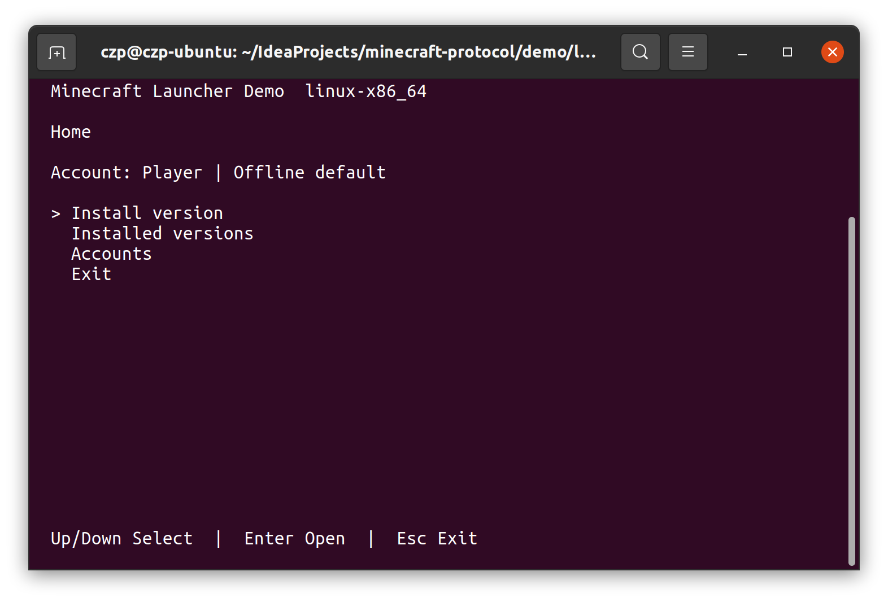
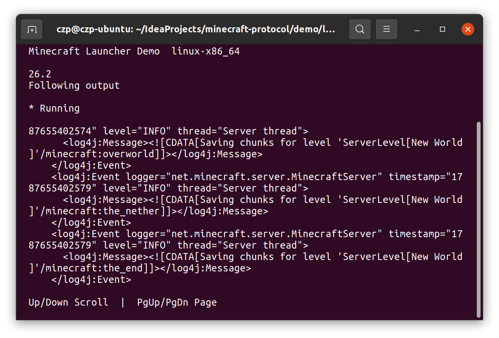

# Minecraft Launcher Demo

This repository includes a terminal launcher for Minecraft: Java Edition. It can browse Mojang's version manifest,
install compatible official game files, manage offline or Microsoft accounts, and launch the official Java client while
showing its output in the terminal.

The launcher is an integration demo, not a supported or published end-user application. Each install task creates a
runnable distribution below `demo/launcher/build/install/launcher-<target>`.

> [!IMPORTANT]
> Gradle cannot correctly forward keyboard input to the TUI, so this demo cannot be run as a Gradle task. Install the
> distribution first, then run the packaged launcher directly.

## Requirements

The computer running the launcher must have `java` available on `PATH`. Run each build command from the repository root.
The command must provide at least the Java major required by the selected game version. Run a native install task only
on a host supported by that Kotlin/Native target.

The launcher's working directory is its state directory. It creates `auth.json`, `installed.json`, and a `minecraft/`
directory there, so start it from a dedicated writable directory. Microsoft refresh and Minecraft access tokens are
stored unencrypted in `auth.json`; use the demo only in a trusted local environment and do not share that file.

## Supported versions

The version list comes from Mojang, but the demo intentionally accepts only metadata it can launch without guessing. It
supports the modern structured `arguments` format and ordinary library/artifact and asset-index layouts. It rejects
legacy `minecraftArguments`, native-classifier/extraction libraries, virtual or resource-mapped assets, unsafe paths,
and unknown launch rules. An entry that uses one of those shapes remains visible in the manifest but fails with an
explanation when installation is attempted.

Downloaded client, library, and asset files are checked against the size and SHA-1 declared by Mojang metadata before an
installation is recorded.

## Interface

The home screen provides access to version installation, installed versions, and account management:



While Minecraft is running, the launcher displays its process output in the TUI:



## JVM

Install the JVM application distribution:

```shell
./gradlew :demo:launcher:installJvmDist
```

Enter the generated application directory and run it on Windows:

```powershell
Set-Location demo/launcher/build/install/launcher-jvm
.\bin\launcher.bat
```

On Linux, use the generated shell script instead:

```shell
cd demo/launcher/build/install/launcher-jvm
./bin/launcher
```

## Windows Native

Install the x64 executable distribution:

```powershell
.\gradlew.bat :demo:launcher:installMingwX64Executable
```

Enter the generated application directory and run it:

```powershell
Set-Location demo/launcher/build/install/launcher-mingwX64
.\launcher.exe
```

## Linux Native

Install the x64 executable distribution:

```shell
./gradlew :demo:launcher:installLinuxX64Executable
```

Enter the generated application directory and run it:

```shell
cd demo/launcher/build/install/launcher-linuxX64
./launcher.kexe
```

On Linux ARM64, install the matching executable distribution:

```shell
./gradlew :demo:launcher:installLinuxArm64Executable
```

Enter the generated application directory and run it:

```shell
cd demo/launcher/build/install/launcher-linuxArm64
./launcher.kexe
```

## macOS Native

Install the ARM64 executable distribution:

```shell
./gradlew :demo:launcher:installMacosArm64Executable
```

Enter the generated application directory and run it:

```shell
cd demo/launcher/build/install/launcher-macosArm64
./launcher.kexe
```
