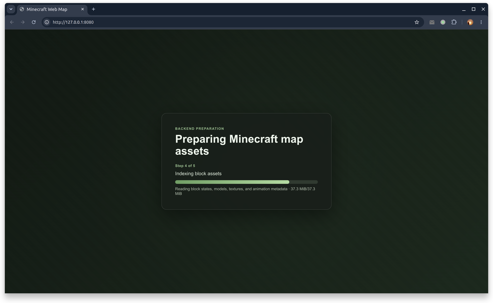
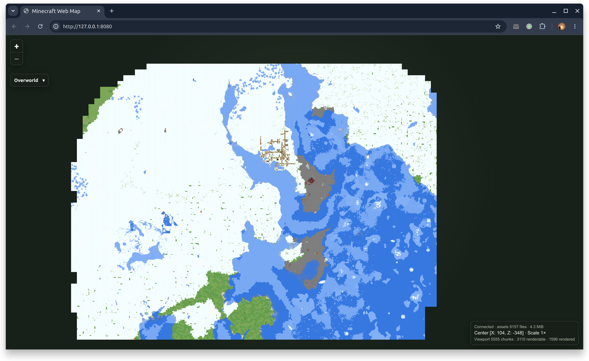
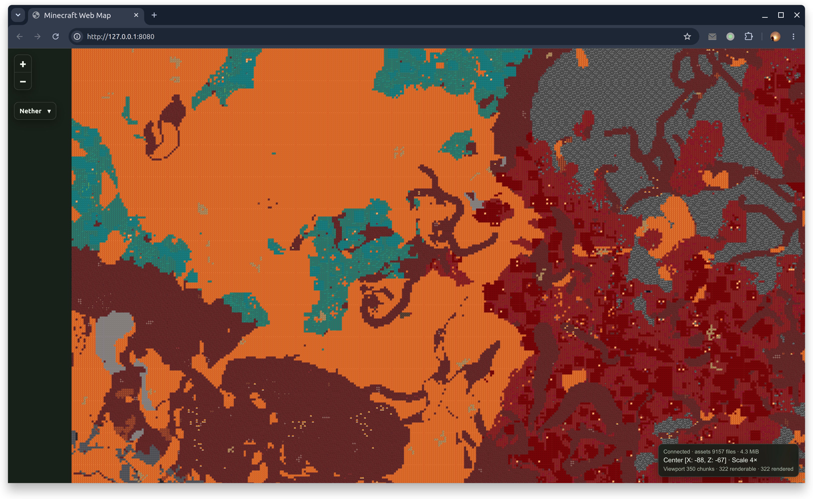
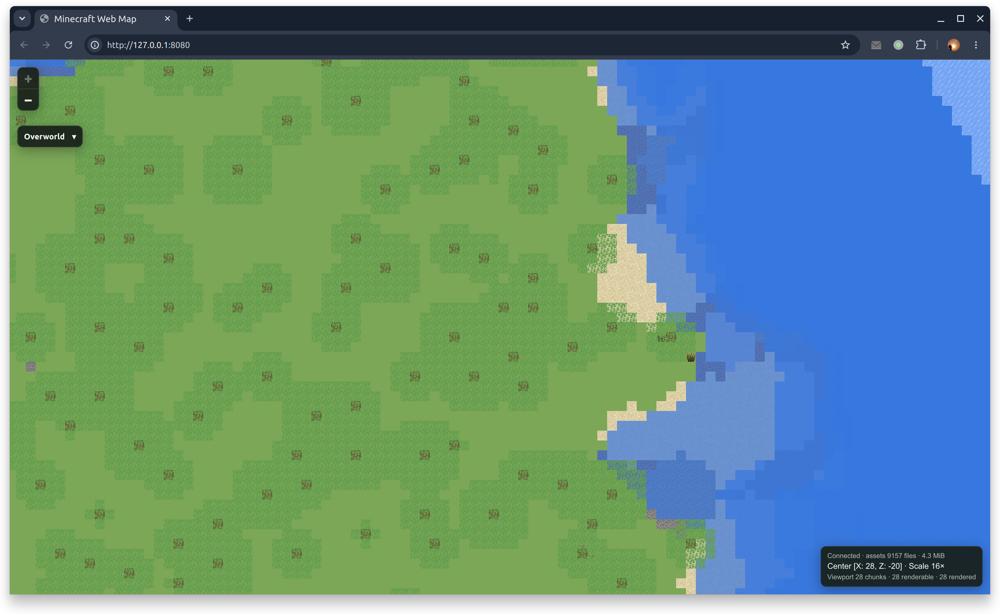
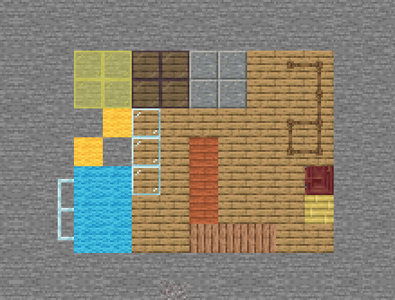

# Minecraft Web Map Demo

This demo displays a saved Minecraft world as a local browser map. It reads the world without modifying it and shows
only changes that Minecraft has saved to disk.

Run all commands from the repository root, and select a world created by the repository-selected Minecraft release. The
world directory must contain `level.dat`.

## Preview











## Windows

In PowerShell, set the world directory:

```powershell
$env:MINECRAFT_WORLD_DIRECTORY = 'C:\Users\you\AppData\Roaming\.minecraft\saves\My World'
```

Start the JVM server:

```powershell
.\gradlew.bat :demo:web-map:runJvm
```

Or start the native x64 server:

```powershell
.\gradlew.bat :demo:web-map:runReleaseExecutableMingwX64
```

Open <http://127.0.0.1:8080> after the server starts. Press `Ctrl+C` in PowerShell to stop it.

## Linux

Set the world directory:

```shell
export MINECRAFT_WORLD_DIRECTORY="$HOME/.minecraft/saves/MyWorld"
```

Start the JVM server:

```shell
./gradlew :demo:web-map:runJvm
```

Or start the native server matching the machine architecture:

```shell
# x64
./gradlew :demo:web-map:runReleaseExecutableLinuxX64

# ARM64
./gradlew :demo:web-map:runReleaseExecutableLinuxArm64
```

Open <http://127.0.0.1:8080> after the server starts. Press `Ctrl+C` in the terminal to stop it.

## macOS

In Terminal, set the world directory:

```shell
export MINECRAFT_WORLD_DIRECTORY="$HOME/Library/Application Support/minecraft/saves/MyWorld"
```

Start the JVM server:

```shell
./gradlew :demo:web-map:runJvm
```

Or, on Apple silicon, start the native server:

```shell
./gradlew :demo:web-map:runReleaseExecutableMacosArm64
```

Open <http://127.0.0.1:8080> after the server starts. Press `Ctrl+C` in the terminal to stop it.

## Optional settings

If `MINECRAFT_WORLD_DIRECTORY` is omitted, the demo uses the first world under the launcher demo's saves directory. The
server listens on `127.0.0.1:8080` by default. Set `MINECRAFT_WEB_MAP_HOST` or `MINECRAFT_WEB_MAP_PORT` before the start
command to change the address.
